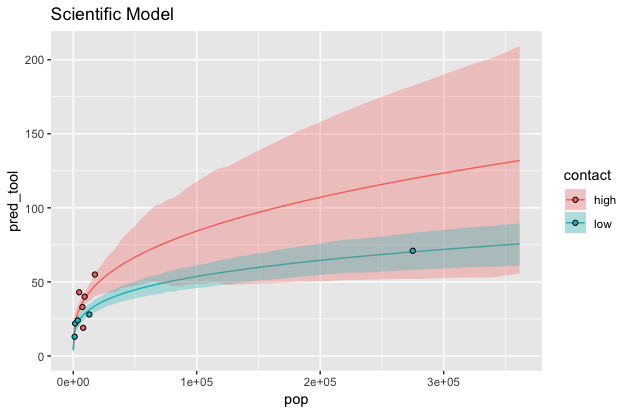

```{r, results='hide'}
library(rethinking)
library(rstan)
library(tidyverse)
library(gridExtra)
library(skimr) # for n_unique func
library(DMwR) # for unscale func
compare = rethinking::compare
```

**CH11 in ver1, CH12 in ver.2 **

In this chapter we will try to combine different likelihood functions in a model to solve some common issues of standard models. These models are often harder to estimate and to understand, but they are important tools. Be sure to check these mixtures and monsters by simulating dummy data and then recovering the data-generating process by fitting the model to the dummy data.

#Over-Dispersion
For a counting model like binomial model or Poisson model, the variance is a function of the expected value. For example the expected value and the variance of a Poisson distribution are both $lambda$ and those of a binomial distribution are $np$ and $np(1-p)$. However, the variance can be larger than this amount in some cases, implying some variables are omitted. This phenomenon is called *over-dispersion*. Although the best solution of is to include the omitted variables that accounts for the variance, we can still mitigate the effects of over-dispersion with some modeling tricks. 

## Continous Mixture Model

### Beta-binomial

Take the **UCB admit** dataset for example, how can we make the correct inference that gender effect is not significant without the information of department?
```{r}
data(UCBadmit)
d_UCBadmit = UCBadmit
d_UCBadmit = d_UCBadmit %>% 
  mutate(gender = ifelse(applicant.gender == "male", 1, 2),
         admit_rate = admit / applications)
d_UCBadmit
```

A straightforward solution for the problem is to assign different probabilities to different rows of the data. This is the intuition of the beta-binomial model. Instead of assigning these probabilities individually, we use the beta-distribution to describe the distribution of them.

Let's take a look at the beta-distribution first. A beta-distribution has two parameters, $\bar{p}$ and $\theta$. $\bar{p}$ suggests the average probability and $\theta$ describes the shape of the distribution.
When $theta$ = 2
```{r}
# In standard r, the parameters of rbeta function is not pbar and theta
# use rbeta2 in rethinking package instead:
# rbeta2 = function( n , prob , theta ) {
#     a = prob * theta
#     b = (1-prob) * theta
#     rbeta( n , shape1=a , shape2=b ) }


pbar = 0.5
theta = 2

random_beta = rbeta2(1000, pbar, theta)
dens(random_beta)
```

With the basic understanding of beta-distribution, we can start building our model.
In m10.2.2 we consider gender effect and use a binomial model:

$logit(p_{gender}) = \alpha_{gender} \\ admits \sim binomial(applications, p)$

Here we still only consider gender effect but with a beta-binomial model. The parameter $p$ in the binomial model becomes the $\bar{p}$ in the beta-binomial model.

$logit(\bar{p}_{gender}) = \alpha_{gender} \\ admits \sim BetaBinom(applications, \bar{p}_{gender}, \theta)$

```{r, results='hide'}
m11.1.1 = "
data {
	int N;
	int admit[N];
	int application[N];
	int L;
	int gender[N];
}

parameters {
	real alpha[L];
	real<lower=0> theta;
}

transformed parameters {
	real pbar[L];
	for (i in 1:L){
		pbar[i] = inv_logit(alpha[i]);
	}
}

model {
	// prior
	for (i in 1:L){
		alpha[i] ~ normal(0, 1.5);
	}

	theta ~ exponential(1);

	// model
	for (i in 1:N){
		admit[i] ~ beta_binomial(application[i], pbar[gender[i]] * theta, (1-pbar[gender[i]]) * theta);
	}	
}

generated quantities {
	real dif_pbar = pbar[1] - pbar[2];
  vector[N] log_lik;
  vector[N] pred_count;
	for (i in 1:N){
		log_lik[i] = beta_binomial_lpmf(admit[i] | application[i], 
                                    pbar[gender[i]] * theta, 
                                    (1-pbar[gender[i]]) * theta);
    pred_count[i] = beta_binomial_rng(application[i], 
                                      pbar[gender[i]] * theta, 
                                      (1-pbar[gender[i]]) * theta);
	}
  
}
"
dat11.1.1 = list(N = nrow(d_UCBadmit),
                 admit = d_UCBadmit$admit,
                 application = d_UCBadmit$applications,
                 gender = d_UCBadmit$gender,
                 L = n_unique(d_UCBadmit$gender))
fit11.1.1 = stan(model_code = m11.1.1, data = dat11.1.1, cores = 2, chains = 2)
```

From the posterior estimation, we can tell that male and female have similar estimated admit rate. And the difference in pbar is not significant. This suggests the correct inference that gender is not a significant factor in this example.
```{r}
print(fit11.1.1, pars = c("alpha", "pbar", "theta", "dif_pbar"))
```
We can also look at the posterior plots of the beta-binomial distribution and admit rate predictions.
In these plots we are going to plot the posterior beta distributions of male and female admission rate. Stan outputs 2000 combinations of pbar and theta. Each combination is one beta distribution. Though it's okay to plot all combinations, it's time consuming. I randomly choose 200 samples.

To plot a distribution using ggplot is something new in this class. Unlike previous examples, we have only the parameters of the distribution not the y value at each x. In base r we can use the *curve* to do this. In ggplot, the alternative is the *stat_function*.

The trick here is to make a customized dbeta function which has **default value** of pbar and theta. By doing so, r can automatically assign x in the right position of the original dbeta2 function. Then I use a for loop to iterate through the parameters output by Stan and assign them to the cust_dbeta function by the *args* parameters. `?stat_function` has an example of doing this.
```{r}
# Posterior Beta-binomial distribution
# ref: https://kohske.wordpress.com/2010/12/25/draw-function-without-data-in-ggplot2/
post11.1.1 = as.data.frame(fit11.1.1, pars=c("pbar", "theta"))


cus_dbeta = function(x, pbar=0, theta=2) {
  dbeta2(x, pbar, theta)
}

p1 = ggplot(data.frame(x = c(0, 1)), aes(x)) + ggtitle("Male Rate")
p2 = ggplot(data.frame(x = c(0, 1)), aes(x)) + ggtitle("Female Rate")

for (i in sample.int(size = 200, n = nrow(post11.1.1))) {
  p1 = p1 + 
    stat_function(fun = cus_dbeta, 
                  args = list(pbar=post11.1.1$`pbar[1]`[i], theta=post11.1.1$theta[i]), 
                  size = 0.01)
  
  p2 = p2 + 
    stat_function(fun = cus_dbeta, 
                  args = list(pbar=post11.1.1$`pbar[2]`[i], theta=post11.1.1$theta[i]), 
                  size = 0.01)
}

p1 = p1 + stat_function(fun = cus_dbeta, args = list(pbar=mean(post11.1.1$`pbar[1]`), theta=mean(post11.1.1$theta)), color="blue")

p2 = p2 + stat_function(fun = cus_dbeta, args = list(pbar=mean(post11.1.1$`pbar[2]`), theta=mean(post11.1.1$theta)), color="blue")

grid.arrange(p1, p2, nrow=1)
```

There is nothing new plotting the admit rate prediction. Since we have one prediction for and the other for female, we need a ifelse statement to plug them in the correct position of the dataframe. For count_prediction, we have predictions on each row so it's similar to what we've done in previous chapters. Don't forget to divide the count by number of applications to get the admit rate.
```{r}
# Posterior admit rate prediction
post11.1.1_count = as.data.frame(fit11.1.1, pars="pred_count")
result11.1.1 = 
  data.frame(
    case = 1:nrow(d_UCBadmit),
    actual = d_UCBadmit$admit_rate) %>% 
  mutate(
    pred = ifelse(case %% 2 == 0, # true: female
                  mean(post11.1.1$`pbar[2]`), # mean of female admit 
                  mean(post11.1.1$`pbar[1]`)), # mean of male admit
    CI_upper = ifelse(case %% 2 == 0,
                      HPDI(post11.1.1$`pbar[2]`)[2],
                      HPDI(post11.1.1$`pbar[1]`)[2]),
    CI_lower = ifelse(case %% 2 == 0,
                      HPDI(post11.1.1$`pbar[2]`)[1],
                      HPDI(post11.1.1$`pbar[1]`)[1]),
    
    PI_upper = post11.1.1_count %>% apply(., 2, HPDI) %>% .[2,] / d_UCBadmit$applications,
    PI_lower = post11.1.1_count %>% apply(., 2, HPDI) %>% .[1,] / d_UCBadmit$applications
  )

p3 = result11.1.1 %>% 
  ggplot() +
  geom_point(aes(case, actual), shape=21, fill="blue") +
  geom_point(aes(case, pred), shape=1) +
  geom_segment(aes(x=case, xend=case,
                   y=CI_upper, yend=CI_lower), size=0.2) +
  geom_point(aes(case, PI_upper), shape=3) +
  geom_point(aes(case, PI_lower), shape=3) +
  ggtitle("Posterior Prediction") +
  scale_x_continuous(breaks = c(1:12))


p3
```

### Gamma-Poisson
The gamma Poisson model is similar to the beta binomial model. It uses a gamma distribution to describe the **rates** of Poisson distributions. We will use the ocean tool example again. Let's look at the scientific model from m10.3.2 first.



We can tell that low cantact rate islands are highly influenced by Hawaii. The gamma Poisson model can solve this problem by adding more variations around the expected rate. The only thing we have to change is on the modeling statement. `tool ~ poisson(lambda);` should be changed to `tool ~ neg_binomial_2(lambda, phi)`.
```{r}
# Prepare data
data(Kline)
d_Kline = Kline
d_Kline = d_Kline %>% 
  mutate(population_std = scale(log(population))[,1],
         contact_id = contact %>% as.integer()) # high = 1, low = 2

test_Kline = data.frame(
  pop_std = c(-5,seq(-1.5, 2.5, length.out = 99)),
  pop = c(-5,seq(-1.5, 2.5, length.out = 99)) %>% 
             unscale(., scale(log(d_Kline$population))) %>% 
             .[,1] %>% exp() %>% 
             rep(., 2),
  contact_id = c(rep(1, 100), rep(2, 100)),
  contact = c(rep("high", 100),rep("low", 100))
)
```

```{r, results='hide'}
m11.1.2 = "
data {
	int N;
	int L;
	int tool[N];
	int population[N];
	int contact[N];

	int test_N;
	real test_population[test_N];
	int test_contact[test_N];
}
parameters {
	real<lower=0> alpha[L];
	real<lower=0> beta[L];
	real<lower=0> gamma;
  real<lower=0> phi;

}
transformed parameters {
	real lambda[N];
	for (i in 1:N){
		lambda[i] = alpha[contact[i]] * population[i] ^ beta[contact[i]] / gamma;
	}
}
model {
	// model
	tool ~ neg_binomial_2(lambda, phi);

	// prior
	alpha ~ lognormal(0, 1); // exp(normal(1,1)) = lognormal(0,1)
	beta ~ exponential(1);
	gamma ~ exponential(1);
  phi ~ exponential(1);
}
generated quantities {
	real log_lik[N];
	real pred_lambda[test_N];

	for (i in 1:N){
		log_lik[i] = neg_binomial_2_lpmf(tool[i] | lambda[i], phi);
	}

	for (i in 1:test_N){
		pred_lambda[i] = alpha[test_contact[i]] * test_population[i] ^ beta[test_contact[i]] / gamma;
	}
}
"

dat11.1.2 = list(
  N = nrow(d_Kline),
  L = d_Kline$contact %>% n_unique(),
  population = d_Kline$population,
  contact = d_Kline$contact_id,
  tool = d_Kline$total_tools,
  test_N = nrow(test_Kline),
  test_population = test_Kline$pop,
  test_contact = test_Kline$contact_id %>% as.integer()
)

fit11.1.2 = stan(model_code = m11.1.2, 
                 data = dat11.1.2, 
                 cores = 2, chains = 2, 
                 warmup = 1500, iter = 3000)
```

From the following posterior plot, we can tell that the gamma Poisson model makes Hawaii less influential to the low cantact islands, which also avoid the overfitting problem.
```{r}
post11.1.2 = as.data.frame(fit11.1.2, pars = "pred_lambda")
result11.1.2 = test_Kline %>% 
  mutate(
    pred_tool = post11.1.2 %>% apply(., 2, mean),
    PI_lower = post11.1.2 %>% apply(., 2, HPDI) %>% .[1,],
    PI_upper = post11.1.2 %>% apply(., 2, HPDI) %>% .[2,])
p11.1.2 = result11.1.2 %>% 
  ggplot(aes(fill=contact)) +
  geom_line(aes(pop, pred_tool, color=contact)) +
  geom_ribbon(aes(x = pop, ymin=PI_lower, ymax=PI_upper), alpha = .3) +
  geom_point(data = d_Kline, aes(d_Kline$population, d_Kline$total_tools, fill=d_Kline$contact), shape=21) +
  ggtitle("Gamma Poisson Scientific Model")
p11.1.2
```

##Multilevel model

The over-dispersion problem can also be solved by constructing a multilevel model. With that, we can assign our own *prior* distribution on the *prior*.

#Zero-inflated
Let's move on to the second part of this chapter, **mixture models**. In many ocassions, the things we observe are not emissions from any simple process. Instead, they are mixtures of multiple processes. A mixture model uses more than one probability distribution to model a mixture of process.

For example, each day, a large number of monks finish copying a small number of manuscripts. The process is Poisson. Now imagine that the monks drink on some days. On those days, no manuscripts are completed. This is a mixture process: there will be zeros on working days and drinking days, as well. If we want to estimate the correct lambda of the Poisson process, we have to estimate how often they drink at the same time.

This mixture can be described using 2 parameters $p_{drink}$, the probability of drinking, and $\lambda$, the rate of Poisson:

$Pr(y = 0|p_{drink}, \lambda) = Pr(drink|p_{drink}) + (1 - Pr(drink|p_{drink})) * Pr(0|\lambda)$
$Pr(y > 0|p_{drink}, \lambda) = (1 - Pr(drink|p_{drink})) * Pr(>0|\lambda)$

And the log-likelihood will be: 

$y = 0: log(p + (1-p)*Pr(Poisson(0|\lambda))$
$y > 0: log((1 - p) * Poisson(y|\lambda)) = log(1-p) + Poisson\_lpmf(y|lambda)$

ref: https://mc-stan.org/docs/2_20/functions-reference/composed-functions.html

There are some tricks modeling this mixture model. 
First is the use of `log_mix` function, which calculates the sum of two log-likelihood easily. 

`log_mix` function is defined as:

$log\_mix(\theta, \lambda_1, \lambda_2) = log(\theta \exp(\lambda_1) + ( 1 - \theta) \exp(\lambda_2))$

As a result, 
$y = 0: \\ log(p + (1-p)*Pr(Poisson(0|\lambda)) \\ = log(p*exp(0) + (1-p)*exp(Poisson\_lpmf(0|\lambda))) \\ = log\_mix(p, 0, Poisson\_lpmf(0|\lambda))$


Second is to use `log1m` function instead of using log(1-x) directly. `log1m` ensures that there is no precision problem when (1-x) is close to 0. 


Before building the model, let's simulate a fake data.
```{r}
# define parameters
prob_drink = 0.2 # 20% of days
rate_work = 1    # average 1 manuscript per day

# sample one year of production
N = 365

d_monk = 
  data.frame(
    # simulate days monks drink
    drink = rbinom( N , 1 , prob_drink )) %>% 
  mutate(
    # simulate manuscripts completed
    output = (1-drink) * rpois( N , rate_work ) # y will be 0 if drink == 1
  )
```


```{r}
ggplot() +
  geom_histogram(data = d_monk, aes(output), fill="blue") +
  geom_histogram(data = d_monk %>% filter(drink==0), aes(output))
  
```

Here we follow the above tricks to build the model.
```{r, results='hide'}
m11.2.1 = "
data {
	int N;
	int y[N];
}
parameters {
	real alpha_p;
	real alpha_lambda;
}
transformed parameters {
	real p = inv_logit(alpha_p); // logit(p) = alpha_p
	real lambda = exp(alpha_lambda); // log(lambda) = alpha_lambda
}
model {
	
	// prior
	alpha_p ~ normal(-1.5, 1);
	alpha_lambda ~ normal(1, 0.5);


	// model
	for (i in 1:N){
		if( y[i] == 0 ) target += log_mix(p, 0, poisson_lpmf(0 | lambda));

		if ( y[i] > 0 ) target += log1m(p) + poisson_lpmf(y[i] | lambda);
	}
	

}

generated quantities {
	real log_lik[N];
	for (i in 1:N){
		if( y[i] == 0 ) log_lik[i] = log_mix(p, 0, poisson_lpmf(0 | lambda));

		if ( y[i] > 0 ) log_lik[i] = log1m(p) + poisson_lpmf(y[i] | lambda);
	}
}
"
dat11.2.1 = list(
  N = nrow(d_monk),
  y = d_monk$output
)
fit11.2.1 = stan(model_code = m11.2.1, data = dat11.2.1,  
                iter = 2000, 
                 cores = 2, chains = 2)
```

The posterior estimations are consistent with the data generating process as the fake data.
```{r}
print(fit11.2.1, pars = c("p", "lambda"))
```


