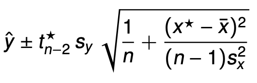
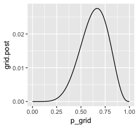

```{r setup, include=FALSE}
knitr::opts_chunk$set(echo = TRUE)
library(tidyverse)
library(rethinking)
library(rstan)
library(gridExtra)
```

## Chapter 3

In this chapter, we will learn about the basic skills for working with samples from the posterior distribution.

In last chapter, we use grid approximation and MCMC(stan) to get the posterior distribution. The model's work has done but our work just started. We are usually required to answer the following questions:

* Interval Estimation
  + How much posterior probability lies below some parameter value?
  + How much posterior probability lies between two parameter values?
  + Which parameter value marks the lower 5% of the posterior probability?
  + Which range of parameter values contains 90% of the posterior probability?

* Point Estimation
Which parameter value has highest posterior probability?

In our past statistics class, these questions are answered with the help of some formulas.
For example, we have formulas to calculate CI for a regression problem:

However, in this class, we use another approach. Since the model give us the samples from the whole posterior distribution, we can make inference from it.

### Samples vs Posterior distribution

What is a posterior distribution?

"The posterior defines the expected frequency that different parameter values will appear."

The posterior distribution from the grid approximation shows the expected probability of each possible `p` values (the proportion of water on the Earch).



In this simple example, the grid approximation generates the whole posterior distribution, while Stan gives us samples from the posterior. However, in most cases we can't have the posterior distribution but only samples.

So in this chapter we’ll begin to use samples to summarize and simulate model output.

### Grid: Sampling from posterior

Grid approximation provides us with the exact posterior distribution. However, we want to make inference using the samples. So we have to draw samples from the posterior first.

Posterior from grid (ch2)
```{r}
d =
   tibble(
     p_grid = seq(from = 0, to = 1, length.out = 100),  # define grid
     prior  = 1) %>%                                   # define prior
   # compute likelihood at each value in grid
   mutate(
     grid.likelihood = dbinom(6, size = 9, prob = p_grid)) %>%  
   # compute product of likelihood and prior
   mutate(
     grid.unstd_post = grid.likelihood * prior) %>%
   # standardize the posterior, so it sums to 1
   mutate(
     grid.post  = grid.unstd_post / sum(grid.unstd_post))


```
Draw samples from posterior distribution
```{r}
sample.size = 1e4 # 10,000 samples

# grid.samples
grid.samples = tibble(
  samples = sample(d$p_grid,
                   size = sample.size, 
                   prob = d$grid.post,
                   replace = T),
  sample_number = 1:sample.size
)

plt2.1 = grid.samples %>% 
  ggplot() +
  geom_point(aes(sample_number, samples), alpha=0.5) +
  labs(y="proportion water (p)")

plt2.2 = grid.samples %>% 
  ggplot() +
  geom_density(aes(samples)) +
  labs(x="proportion water (p)") +
  ggtitle("Grid Result")

grid.arrange(plt2.1, plt2.2, nrow=1)
```

### MCMC: Already have samples

On the other hand, MCMC just gives us samples. We can work directly with its output.
```{r, results='hide'}
binom.model = "
data {
	int N; // number of data
	int W; // number of w observations
}
parameters {
	real<lower=0, upper=1> p;
}
model {
	p ~ uniform(0,1);
	W ~ binomial(N, p);
}
"
binom.data = list(N = 9, W = 6)
binom.fit = stan(model_code = binom.model, 
                 data = binom.data, 
                 chains = 2,
                 iter = sample.size)
```

```{r}
mcmc.samples = 
  as.data.frame(binom.fit) %>% 
  mutate(sample_number = 1:sample.size) %>% 
  rename(., "samples" = "p") # forgive the weird r logic...

plt2.3 = mcmc.samples %>% 
  ggplot() +
  geom_point(aes(sample_number, samples), alpha=0.5) +
  labs(y="proportion water (p)")

plt2.4 = mcmc.samples %>% 
  ggplot() +
  geom_density(aes(samples)) +
  labs(x="proportion water (p)")+
  ggtitle("MCMC Result")

grid.arrange(plt2.3, plt2.4, nrow=1)
```

The above 2 plots shows that samples from either approach are the same. So in the following tutorial I will only use the `grid.samples` data. The output will be the quite similar when we change it to `mcmc.samples` data.

### Interval Estimation
In this section, we are going to answer the following questions:

1. How much posterior probability lies below some parameter value?

2. How much posterior probability lies between two parameter values?

3. Which parameter value marks the lower 5% of the posterior probability?

4. Which range of parameter values contains 90% of the posterior probability?


#### Intervals of defined boundaries
1. How much posterior probability lies below some parameter value(ex: 0.5)?
```{r}
grid.samples %>% 
  filter(samples < 0.5) %>% 
  summarise(count = nrow(.),
            prob = nrow(.) / sample.size)

```
2. How much posterior probability lies between two parameter values(ex: 0.5 ~ 0.75)?
```{r}
grid.samples %>% 
  filter(samples > 0.5 & samples < 0.75) %>% 
  summarise(count = nrow(.),
            prob = nrow(.) / sample.size)
```
#### Intervals of defined mass

1. Which parameter value marks the lower 5% of the posterior probability?
```{r}
grid.samples$samples %>% quantile(., probs = .05)
```

2. Which range of parameter values contains 90% of the posterior probability?
```{r}
grid.samples$samples %>% quantile(., probs = .9)

```

3. PI: Percentile Intervals
```{r}
grid.samples$samples %>% PI(., prob = .95)
grid.samples$samples %>% quantile(., probs = c(.025, .975))
```

4. HPDI: Highest Posterior Density Interval
```{r}
grid.samples$samples %>% HPDI(., prob = .95)
```

### Point Estimation
`Loss Function`: A rule that tells you the cost associated with using any particular point estimate.

**only in such a simple example can we calculate the result of the loss function**

* Common loss func.
  + absolute loss function: `median`
  + quadratic loss function: `mean`
  + problem specific loss func
  

### Simulation
Another common task for us is to perform `back test`. We can generate *fake data* using the samples of `p`(proportion of water).

```{r}
grid.samples = grid.samples %>% 
  mutate(fake.Q = grid.samples %>% 
           apply(., 1, function(x) rbinom(n=1, size=9, prob =x[1])))

plt2.5 = grid.samples %>% 
  ggplot() + 
  geom_histogram(aes(fake.Q), binwidth = .3)+
  scale_x_continuous(breaks = seq(from=0, to=9, by = 3)) +
  coord_cartesian(xlim = 0:9) +
  ggtitle("Fake Data from Posterior")

plt2.5
```

### Explaining Textbook Fig3.6

```{r fig.height = 15, fig.width = 8}
d2 =
   tibble(
     p_grid = seq(from = 0, to = 1, by = .1),  # define grid
     prior  = 1) %>%                                   # define prior
   # compute likelihood at each value in grid
   mutate(
     grid.likelihood = dbinom(6, size = 9, prob = p_grid)) %>%  
   # compute product of likelihood and prior
   mutate(
     grid.unstd_post = grid.likelihood * prior) %>%
   # standardize the posterior, so it sums to 1
   mutate(
     grid.post  = grid.unstd_post / sum(grid.unstd_post)) %>% 
   mutate(
     round.unstd_post = round(grid.unstd_post, 2)
   )

plt2.6 = ggplot(NULL)+
  geom_line(data=d, aes(p_grid, grid.unstd_post)) +
  geom_point(data=d2, aes(p_grid, grid.unstd_post)) +
  geom_col(data=d2, aes(p_grid, grid.unstd_post), width=.01) +
  geom_text(data=d2, aes(p_grid, grid.unstd_post, label=round.unstd_post),vjust=-1.5)+
  labs(y="density", x="proportion of water(p)") +
  ggtitle("Posterior Probability")

grid.samples = grid.samples %>% 
  mutate(key = str_c("p = ", round(samples, digits = 1)))

plt2.7 = grid.samples %>% 
  ggplot() + 
  geom_histogram(aes(fake.Q), binwidth=.3) +
  scale_x_continuous(breaks = seq(from=0, to=9, by = 3)) +
  scale_y_continuous(breaks = NULL) +
  coord_cartesian(xlim = 0:9) +
  facet_wrap(~key, ncol=10, scales = 'free') +
  ggtitle("Distribution of Samples from Each p")

plt2.8 = grid.samples %>% 
  ggplot() + 
  geom_histogram(aes(fake.Q), binwidth=.3) +
  scale_x_continuous(breaks = seq(from=0, to=9, by = 3)) +
  scale_y_continuous(breaks = NULL) +
  coord_cartesian(xlim = 0:9) +
  facet_wrap(~key, ncol=10) +
  ggtitle("Weighted Distribution")

grid.arrange(plt2.6, plt2.7,plt2.8, plt2.5, ncol=1)
```


