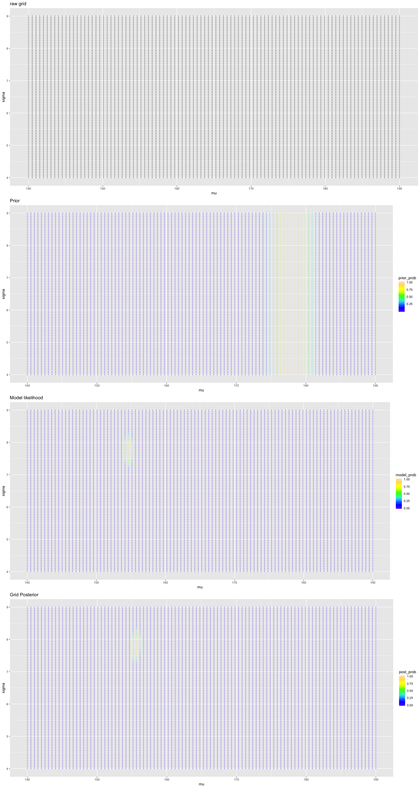

```{r}
library(rethinking)
library(tidyverse)
library(gridExtra)
library(rstan)
```

## Ch4 Linear Model

Create the data
```{r}
data(Howell1)
d <- Howell1
d2 <- d[ d$age >= 18 , ]
```

EDA on height
```{r}
d2 %>% 
  ggplot() +
  geom_histogram(aes(height))
```

### Gaussian Model
#### Grid Approximation

We look at the result first then expain the code later.



1. set the grid for both `mu` and `sigma`.
2. set priors for mu and sigma.
   + `mu ~ N(178, 2)`
   + `sigma ~ unif(0, 50)`
3. calculate the model likelihood.
4. calculate the posterior (prior * likelihood)

Code Explaination
```{r}
# setting grid
grid.size = 100
mu.list = seq(from=140, to=190, length.out = grid.size)
sigma.list = seq(from=4, to=9, length.out = grid.size)
post = expand.grid(mu=mu.list, sigma=sigma.list)
post
```

```{r}
# prior
post  = post %>% 
  mutate(prior_mu = apply(., 1, function(x) dnorm(x[["mu"]], 
                                                  mean = 178, 
                                                  sd = 2, 
                                                  log = T)),
         prior_sigma = apply(., 1, function(x) dunif(x[["sigma"]],
                                                     min = 0,
                                                     max = 50,
                                                     log = T)))
post
```

```{r}
# Model likelihood
grid_function = function(mu, sigma){
  dnorm(d2$height, mean=mu, sd = sigma, log=T) %>% sum()
}

post = post %>% 
  mutate(model_likelihood = 
           apply(., 1, function(x) grid_function(x[["mu"]], x[["sigma"]])))

post
```

```{r}
# Posterior
post = post %>% 
  mutate(prior_likelihood = prior_mu + prior_sigma,
         post_likelihood = prior_likelihood + model_likelihood) %>% 
  mutate(post_prob = exp(post_likelihood - max(post_likelihood)),
         prior_prob = exp(prior_likelihood - max(prior_likelihood)),
         model_prob = exp(model_likelihood - max(model_likelihood)))
post
```

```{r fig.height = 15, fig.width = 8}
# Plotting
{
plt1 = post %>% 
  ggplot()+
  geom_point(aes(mu, sigma), size=50/grid.size, shape=16)+
  ggtitle("raw grid")

plt2 = post %>% 
  ggplot()+
  geom_point(aes(mu, sigma, color=prior_prob), size=50/grid.size, shape=16) +
  scale_colour_gradientn(colours = topo.colors(10)) +
  ggtitle("Prior")

plt3 = post %>% 
  ggplot() +
  geom_point(aes(mu, sigma, color=model_prob), size=50/grid.size, shape=16) +
  scale_colour_gradientn(colours = topo.colors(10)) +
  ggtitle("Model likelihood")
  
plt4 = post %>% 
  ggplot() +
  geom_point(aes(mu, sigma, color=post_prob), size=50/grid.size, shape=16) +
  scale_colour_gradientn(colours = topo.colors(10)) +
  ggtitle("Grid Posterior")
}

grid.arrange(plt1,plt2,plt3,plt4, ncol=1)
```


#### MCMC
```{r, results="hide"}
normal.model = "
data {
	int N;
	vector[N] x;
}
parameters {
	real mu;
	real sigma;
}
model {
	// prior
	mu ~ normal(178, 20);
	sigma ~ uniform(0, 50);

	// model
	x ~ normal(mu, sigma);
}
"
normal.data = list(N = nrow(d2), x = d2$height)
normal.fit = stan(model_code = normal.model, 
                  data = normal.data, 
                  iter = 5000, 
                  chains = 2)
```

```{r fig.height = 8, fig.width = 8}
normal.post = normal.fit %>% 
  as.data.frame() %>% 
  select(mu, sigma)

plt5 = normal.post %>% 
  ggplot() +
  geom_bin2d(aes(mu, sigma), bins=100) +
  xlim(140, 190) +
  ylim(4, 9)

grid.arrange(plt4, plt5, ncol=1)
```


### Simple Linear Regression

#### Uneducated Prior
1. Data
 + x = weight
 + y = height
2. Prior
 + `alpha ~ normal(178, 20)`
 + `beta ~ normal(0, 10)`
 + `sigma ~ unif(0, 50)`
3. Model
 + mu = alpha + beta * (weight - mean(weight))
 + height ~ normal(mu, sigma)

```{r}
d2$weight.c = d2$weight - mean(d2$weight)
```

```{r}
prior.data = tibble(
  alpha = rnorm(100, mean = 178, sd = 20),
  beta = rnorm(100, mean = 0, sd = 10)
)

p = ggplot()

for (i in 1:100) {
  d2$pred_height = 
    prior.data[[i, "alpha"]] +
    prior.data[[i, "beta"]] * (d2$weight - mean(d2$weight))
  
  p = p + 
    geom_line(data = d2, aes(weight, pred_height), alpha=.3)
}

p
```

#### Better Prior

 + `alpha ~ normal(178, 20)`
 + `beta ~ log-normal(0, 1)` (same as `log(beta) ~ normal(0, 1)`)
 + `sigma ~ unif(0, 50)`
 
```{r}
prior.data2 = tibble(
  alpha = rnorm(100, mean = 178, sd=20),
  beta  = rlnorm(100, mean = 0, sd = 1)) # the only thing changed

# dens(prior.data2$beta)

p2 = ggplot(data = NULL)

for (i in 1:100) {
  d2$pred_height = 
    prior.data2[[i,"alpha"]] + 
    prior.data2[[i,"beta"]] * (d2$weight - mean(d2$weight))
  
  p2 = p2 +
    geom_line(data=d2, aes(weight, pred_height), alpha=.3)
}

p2
```
There is *no* correct prior. Priors are information we know before seeing data. 
Here we know that weight should not be negatively related to height. Thus a log-normal prior is provided.

When we don’t have such information, we still usually know enough about the plausible range of values. 

We can try different priors to choose a reasonable one.
More importantly, when we have lots of data, model likelihood will dominate the posterior.

#### Model fitting
```{r, results="hide"}
LR.model = "
data {
	int N;
	vector[N] x;
	vector[N] y;
}

parameters {
	real alpha;
	real<lower=0> beta;
	real sigma;
}

model {
	vector[N] mu = alpha + beta * x;

  // prior
	alpha ~ normal(178, 20);
	beta ~ lognormal(0, 1);
  sigma ~ uniform(0, 50);

	// model
	y ~ normal(mu, sigma);
}


generated quantities {
	real pred_y[N];
  vector[N] mu = alpha + beta * x;

	mu = alpha + beta * x;
	pred_y = normal_rng(mu, sigma);
}
"

LR.data = list(
  N = nrow(d2),
  x = d2$weight.c,
  y = d2$height
)
LR.fit = stan(model_code = LR.model,
              data = LR.data,
              chains = 2,
              iter = 1000,
              cores = 2)
LR.post = as.data.frame(LR.fit)
```

### Interpreating Posterior

#### Confidence Interval
The interval for **mean** prediction on each weight.
```{r}
pred_mu = LR.post %>% 
  select(contains("mu"))

CI = data.frame(
  mean = pred_mu %>% apply(., 2, mean),
  L_HPDI = pred_mu %>% apply(., 2, HPDI) %>% .[1,],
  H_HPDI = pred_mu %>% apply(., 2, HPDI) %>% .[2,],
  weight = d2$weight
)

CI %>% 
  ggplot() +
  geom_point(data = d2, aes(weight, height), color="blue", alpha=.3) +
  geom_line(aes(weight, mean)) +
  geom_ribbon(aes(x=weight,ymin=L_HPDI, ymax=H_HPDI), alpha=.3) +
  ggtitle("89% Confidence Interval")
```

#### Prediction Interval
The interval for **one** prediction on each weight.
```{r}
pred_y = LR.post %>% 
  select(contains("pred_y"))

PI = data.frame(
  mean = pred_y %>% apply(., 2, mean),
  L_HPDI = pred_y %>% apply(., 2, HPDI) %>% .[1,],
  H_HPDI = pred_y %>% apply(., 2, HPDI) %>% .[2,],
  weight = d2$weight
)

PI %>% 
  ggplot() +
  geom_point(data = d2, aes(weight, height), color="blue", alpha=.3) +
  geom_line(aes(weight, mean)) +
  geom_ribbon(aes(x=weight,ymin=L_HPDI, ymax=H_HPDI), alpha=.3) +
  ggtitle("89% Prediction Interval")


```
#### CI vs PI

```{r}
ggplot()+
  geom_point(data = d2, aes(weight, height), color="blue", alpha=.3) +
  geom_line(data=CI, aes(weight, mean)) +
  geom_ribbon(data=CI, aes(x=weight, ymin=L_HPDI, ymax=H_HPDI), alpha=.5) +
  geom_ribbon(data=PI, aes(x=weight,ymin=L_HPDI, ymax=H_HPDI), alpha=.2) +
  xlim(35, 60)
```

### Polynomial Regression

```{r}
d %>% 
  ggplot() +
  geom_point(aes(scale(weight), height))
```

```{r, results="hide"}
PLR.model = "
data {
	int N;
	vector[N] x;
	vector[N] y;
}
parameters {
	real alpha;
	real<lower=0> beta1;
	real beta2; // add another coefficient
	real sigma;
}
model {
  vector[N] mu;
	// prior
	alpha ~ normal(178, 20);
	beta1 ~ lognormal(0, 1);
	beta2 ~ normal(0, 10); // add another prior
	sigma ~ uniform(0, 50);

	// model
	mu = alpha + beta1 * x + beta2 * (x .* x); // .* : elementwise product
	y ~ normal(mu, sigma);
}

generated quantities {
	real pred_y[N];
  vector[N] mu;

	mu = alpha + beta1 * x + beta2 * (x .* x); // .* : elementwise product
	pred_y = normal_rng(mu, sigma);
}
"
PLR.data = list(
  N = nrow(d),
  x = scale(d$weight)[,1],
  y = d$height
)

PLR.fit = stan(model_code = PLR.model, 
               data = PLR.data, 
               chains = 2, 
               cores = 2,
               iter = 1000)
```
Check the result
```{r}
PLR.fit
PLR.post = as.data.frame(PLR.fit)
```

#### CI & PI
Data for CI:

We need to change `weight.c` to `weight.z` and modify `pred_func`.
```{r}
# CI
pred_mu = PLR.post %>% 
  select(contains("mu"))

CI = data.frame(
  mean = pred_mu %>% apply(., 2, mean),
  L_HPDI = pred_mu %>% apply(.,2,HPDI) %>% .[1,],
  H_HPDI = pred_mu %>% apply(.,2,HPDI) %>% .[2,],
  weight = d$weight)
```
Data for PI:

The only thing we need to do is to change `LR.post` to `PLR.post`.
```{r}
pred_y = PLR.post %>% 
  select(contains("pred_y"))

PI = data.frame(
  mean = pred_y %>% apply(., 2, mean),
  L_HPDI = pred_y %>% apply(.,2,HPDI) %>% .[1,],
  H_HPDI = pred_y %>% apply(.,2,HPDI) %>% .[2,],
  weight = d$weight)
```

plotting the result
```{r}
ggplot()+
  geom_point(data = d, aes(weight, height), color="blue", alpha=.3) +
  geom_line(data=CI, aes(weight, mean)) +
  geom_ribbon(data=CI, aes(x=weight, ymin=L_HPDI, ymax=H_HPDI), alpha=.8) +
  geom_ribbon(data=PI, aes(x=weight,ymin=L_HPDI, ymax=H_HPDI), alpha=.2)
```

