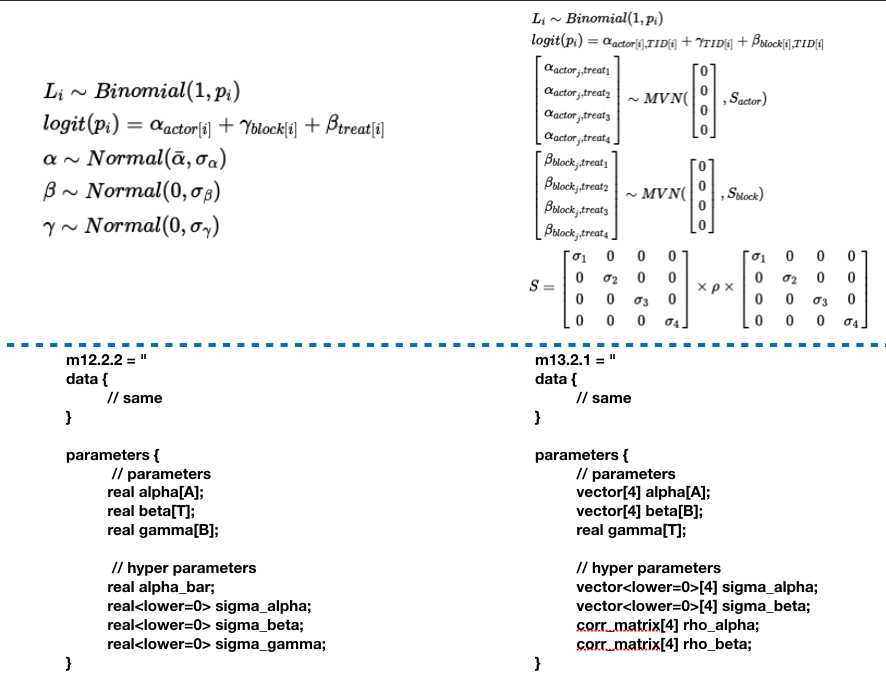
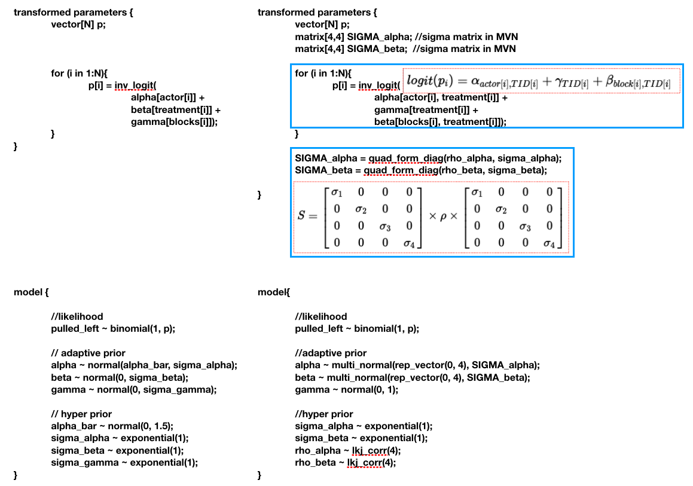
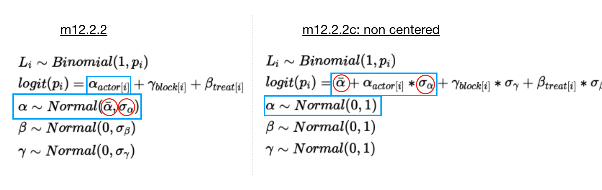

```{r, results='hide'}
library(rethinking)
library(rstan)
library(tidyverse)
library(gridExtra)
library(skimr) # for n_unique func
library(DMwR) # for unscale func
library(MASS)
compare = rethinking::compare
select = dplyr::select
```

# Intro

**Ch13 in ver.1, Ch14 in ver.2**
This is the first chapter in the course about multivariate model, which means we will analyze more than one outcome variable at a time.

The concepts and codes are much more complicated than any other chapter in the textbook. Honestly I didn't understand most of the content in the class. I hope my learning experience can help you understand the material. Read the textbook may help you understand them better.

In previous chapter, we learn about the construction of **varying intercepts** model. In these models, there is only one parameters in each group. In this chapter, we will learn about the how to **pool information between parameters** when there are more than one parameters(ex: intercepts and slopes) in one group.

We will talk about these cases in the tutorial:
  
  1. more than one intercept in many clusters(categorical variables, ver2-ch14.2)
  
  2. social relations model(categorical variables, ver2-ch14.4)
  
  3. gaussian process(continous categories, ver2-ch14.5)


# Case1: more than one intercept
Suppose we have a record of the waiting time of two cafés. The cafés vary in their average wait times($\alpha_{cafe[i]}$), and in their differences between morning and afternoon($\beta_{cafe[i]}$). There are now 2 parameters we are interested in now.

In tradictional approach, we will assign different prior for the two parameters, assuming they are indepent from others. But the fact is that they are probably related. At a popular café, wait times are on average long in the morning. But the same café will be much less busy in the afternoon since they have more staffs and fewer customers. But at a less popular café, the difference will be small. 

To pool the information from 2 parameters, we have to model their joint population, which means by modeling their covariance. The device that makes this possible is a **multivariate Gaussian distribution** for all of the varying effects.

In the first example, we will generate the fake café data and do the retrodiction to understand how the model works.

## Set hyper pars
Firstly we have to set the parameters for all cafes. 
```{r}
a = 3.5         #average morning wait time
b = (-1)        #average difference
sigma_a = 1     #std dev in wait time
sigma_b = .5    #std dev in difference
rho = (-0.7)    # correlation between a and b
```

Since we need to estimate 2 parameters at a time, we will need a 2-dimensional multivariate gaussian distribution. A 2-D multivariate gaussian is consisted of a 2x1 Mu vector and a 2x2 covariance matrix.

$Mu = \left\{\begin{matrix} avg \ par1 \\ avg \ par2\end{matrix}\right\} \\ Cov=\left\{\begin{matrix}var \ of \ par1 & cov \ of \ par1 \ and \ par 2  \\cov \ of \ par1 \ and \ par 2 & var \ of \ par2 \end{matrix} \right\}$

or in math form:

$Mu = \left\{\begin{matrix} \bar\alpha \\ \bar\beta\end{matrix}\right\} \\ Cov=\left\{\begin{matrix}\sigma^2_{\alpha} & \sigma_{\alpha}\sigma_{\beta}\rho \\  \sigma_{\alpha}\sigma_{\beta}\rho & \sigma^2_{\beta} \end{matrix} \right\}$

Though we can build the covariance matrix simply by putting the 4 elements all together, the recommended method is to do matrix multiplication:

$Cov=\left\{\begin{matrix}\sigma^2_{\alpha} & \sigma_{\alpha}\sigma_{\beta}\rho \\  \sigma_{\alpha}\sigma_{\beta}\rho & \sigma^2_{\beta} \end{matrix} \right\} = \left\{\begin{matrix}\sigma_{\alpha} & 0 \\  0 & \sigma_{\beta} \end{matrix} \right\} \times \left\{\begin{matrix}1 & \rho \\  \rho & 1 \end{matrix} \right\} \times \left\{\begin{matrix}\sigma_{\alpha} & 0 \\  0 & \sigma_{\beta} \end{matrix} \right\}$


```{r}
Mu = c( a , b )
cov_ab = sigma_a*sigma_b*rho

#Method 1:
Cov = matrix( c(sigma_a^2,cov_ab,cov_ab,sigma_b^2) ) 

#Method 2(recommend):
sigmas = c(sigma_a,sigma_b)
Rho = matrix( c(1,rho,rho,1) , nrow=2 )
Cov = diag(sigmas) %*% Rho %*% diag(sigmas)
```

## cafe pars
Now we’re ready to simulate some cafés from the hyper parameters we have set. The results are the **average wait time** and **average difference** of each cafe.
```{r}
N_cafes = 20
vary_effects = mvrnorm( N_cafes , Mu , Cov )

vary_effects = data.frame(
  a_cafe = vary_effects[,1],
  b_cafe = vary_effects[,2]
)

vary_effects
```
The result is a 20x2 matrix. Each row is a cafe while the first column is the wait time and the second column is the difference.

Let's visualize the result:
```{r}
p1.1 = vary_effects %>% 
  ggplot(aes(a_cafe, b_cafe)) +
  geom_point()

for (i in c(c(0.1,0.3,0.5,0.8,0.99))) {
  p1.1 = p1.1 + 
    stat_ellipse(type = "norm", level = i, alpha=.2)
}

p1.1
```
We can use the `stat_ellipse` function to plot a 2-D gaussian distribution. By setting different `level`, the function will plot the ellipses with different confidence intervals.

## Draw observation
The last step is to draw observations from the **average wait time** and **average difference** of each cafe. We will *visit* each cafe by 10 times, 5 in the morning and 5 in the afternoon. The resulting d_cafe dataframe will have 200 rows with 100 rows in the morning.
```{r}
N_visits = 10
sigma = 0.5 # std dev within cafes

d_cafe = data.frame(
  cafe_id = rep( 1:N_cafes , each=N_visits ),
  afternoon = rep(0:1,N_visits*N_cafes/2) # 0 = morning, 1 = afternoon
) %>% 
  mutate( 
    mu = vary_effects$a_cafe[cafe_id] + vary_effects$b_cafe[cafe_id]*afternoon,
    wait = rnorm( N_visits*N_cafes , mu , sigma ))

d_cafe = d_cafe %>% select(-mu)
```

## Model
Before getting into the stan model, let's briefly review what we have done in a math form:

$W_i \sim Normal(\mu_i, \sigma) \\ \mu_i = \alpha_{cafe[i]} + \beta_{cafe[i]}A_i \\ \begin{bmatrix}\alpha_{cafe} \\ \beta_{cafe} \end{bmatrix} \sim MVN(\begin{bmatrix}\alpha \\ \beta \end{bmatrix}, S) \\ S = \left\{\begin{matrix}\sigma_{\alpha} & 0 \\  0 & \sigma_{\beta} \end{matrix} \right\} \times \left\{\begin{matrix}1 & \rho \\  \rho & 1 \end{matrix} \right\} \times \left\{\begin{matrix}\sigma_{\alpha} & 0 \\  0 & \sigma_{\beta} \end{matrix} \right\}$

This line states that each café has 2 parameters with a prior distribution defined by the 2-D Gaussian distribution with *global* means $\alpha$ and $\beta$ and covariance matrix S.

$\begin{bmatrix}\alpha_{cafe} \\ \beta_{cafe} \end{bmatrix} \sim MVN(\begin{bmatrix}\alpha \\ \beta \end{bmatrix}, S)$

With this in mind, we are one step from building the stan model, how to set the prior. The prior for $\alpha, \beta, \sigma_{alpha}, \sigma_{\beta}$ are the same as previous models. The only trick is about setting the prior for the correlation matrix $R = \left\{\begin{matrix}1 & \rho \\  \rho & 1 \end{matrix} \right\}$. It isn’t easy to imagine what a distribution of
matrices means. But in this case, the correlation
matrix is only 2-by-2 so there is only one parameter $\rho$. For more complicated cases, the same prior, **LKJ distribution** still works.

Let's see how a LKJ distribution works.  LKJcorr(eta = 2) defines a weakly informative prior on ρ that is skeptical of extreme correlations near −1 or 1. LKJ distribution has a single parameter, eta. When we eta = 1, the prior is flat. When eta becomes larger, it will be more skeptical on the extreme values(-1 or 1).

### lkj prior
```{r}
R = rlkjcorr(n = 1000, K = 3, eta = 2)  # K: dim, eta: shape

dim(R)

R[1,,]

rho = data.frame(
  rho_1 = rlkjcorr(n = 1e4, K = 2, eta = 1)[,1,2], 
   rho_2 = rlkjcorr(n = 1e4, K = 2, eta = 2)[,1,2],
   rho_4 = rlkjcorr(n = 1e4, K = 2, eta = 4)[,1,2]
)

rho %>% ggplot()+
  geom_density(aes(rho_1), adjust = .5) +
  geom_density(aes(rho_2), adjust = .5) +
  geom_density(aes(rho_4), adjust = .5) +
  annotate(geom = "text", x = c(0,0,0), y = c(.4, .6, .9), label = c("eta = 1", "eta = 2", "eta = 4"))

```

### Stan
We can start writing the Stan program now. We need some new coding techniques to deal with the matrixs and vectors in our model.

There is a new data type `corr_matrix`. Though a correlation matrix is just a N x N matrix, values in `corr_matrix` are limited(-1 ~ 1), which improve the performance, by using the corr_matrix instead.

In the transformed parameters, we first have to transfrom our data to match the required datatype of the MVNormal function `vectors y ~ MVNormal(vectors mu, matrix Cov)`. Notice that our y is an 2 x N_cafe array. However, we have to declare it as `vector[2] y[N_cafe]` with the first row `y[,1]` being the alpha vector and second row `y[,2]` the beta vector to meet the MVN function requirement.

Besides, we need to construct the sigma matrix for MVN. we can use the `quad_form_diag` function to do the $S = \left\{\begin{matrix}\sigma_{\alpha} & 0 \\  0 & \sigma_{\beta} \end{matrix} \right\} \times \left\{\begin{matrix}1 & \rho \\  \rho & 1 \end{matrix} \right\} \times \left\{\begin{matrix}\sigma_{\alpha} & 0 \\  0 & \sigma_{\beta} \end{matrix} \right\}$ calculation elegantly.


```{r, results='hide'}
m13.1 = "
data{
	int N;
	int N_cafe;
	int cafe_id[N];
	int afternoon[N];
	real wait[N];
}
parameters{
	
	//parameters
	real alpha[N_cafe];
	real beta[N_cafe];
	real<lower=0> sigma_cafe;

	//hyperparameters
	vector<lower=0>[2] sigma_par; // [sigma_alpha, sigma_beta]
	corr_matrix[2] R;
	real hyper_alpha;
	real hyper_beta;

}
transformed parameters{

	//variable declarations
	vector[2] y[N_cafe];	  // y vector, N_cafe x 2 matrix
  vector[2] Mu;					  // Mu vector in MVN
	matrix[2, 2] Cov;			// Cov matrix in MVN
	vector[N] mu_cafe;			// mu_cafe

  // y vector
	for (j in 1:N_cafe) {
		y[j, 1] = alpha[j];
		y[j, 2] = beta[j];

	// Mu vector in MVN
	Mu[1] = hyper_alpha;
	Mu[2] = hyper_beta;
	
	// Cov matrix in MVN
	Cov = quad_form_diag(R, sigma_par); 
	// i.e. diag_matrix(sigma_par)  * R * diag_matrix(sigma_par)

	
	}

	// mu_cafe
	for (i in 1:N){
		mu_cafe[i] = alpha[cafe_id[i]] + beta[cafe_id[i]] * afternoon[i];}

}
model{
	
	//model
	wait ~ normal(mu_cafe, sigma_cafe);

	//prior
	y ~ multi_normal(Mu, Cov);
	sigma_cafe ~ exponential(1);

	//hyper prior
	hyper_alpha ~ normal(5, 2);
	hyper_beta ~ normal(-1, 0.5);
	R ~ lkj_corr(2);
	sigma_par ~ exponential(1);


}
generated quantities {
	vector[N] log_lik;
	for (i in 1:N){
		log_lik[i] = normal_lpdf(wait[i] | mu_cafe[i], sigma_cafe);
	}
}
"
dat13.1 = list(
  N = nrow(d_cafe),
  N_cafe = d_cafe$cafe_id %>% n_unique(),
  cafe_id = d_cafe$cafe_id,
  afternoon = d_cafe$afternoon,
  wait = d_cafe$wait
)
fit13.1 = stan(model_code = m13.1, data = dat13.1, cores = 2, chains = 2, iter = 5000)
```

## Posterior
Let's check if our model is able to estimate the correct parameters we set.

$\alpha = 3.5 \\ \beta=-1 \\ \sigma_{\alpha} = 1 \\ \sigma_{\beta} = 0.5 \\ \rho = -0.7$

```{r}
print(fit13.1, 
      pars = c("hyper_alpha", "hyper_beta", "sigma_par", "R"), 
      probs = c())
```

The results shows that the model learned the negative correlation on $\alpha$ and $\beta$ even though it had only observed wait times in morning and afternoon.

We can also see the shrinkage effect of this adaptive regularization model. Let’s plot the unpooled estimates, posterior mean varying effects(partially pooled) and the contours from the inferred prior.

### Unpooled result
The unpooled result are directly from the data we generated. We just compute the mean of the wait time for each cafe in the morning($\alpha$) and the afternoon respectively and substract morning wait from afternoon wait to get the difference($\beta$).
```{r}
unpooled = d_cafe %>% 
  group_by(cafe_id, afternoon) %>% 
  summarise(wait = mean(wait)) %>% 
  ungroup() %>% 
  mutate(afternoon = ifelse(afternoon == 1, "afternoon", "morning")) %>% 
  spread(afternoon, wait) %>% 
  mutate(difference = afternoon - morning)
unpooled

p1.2.1 = ggplot()+
  geom_point(data = unpooled, aes(x = morning, y = difference))
p1.2.2 = ggplot()+
  geom_point(data = unpooled, aes(x = morning, y = afternoon))
```

### Partially pooled
For partially pooled data, we extract samples from the stan model then filtered out the alpha and beta column.

Plotting the scatter plot is the same as the unpooled part.
Then, we can connect the same cafe in unpooled / partially_pooled to visualize the shrinkage effect. Notice that we have to set the data in `geom_segment` to `NULL` otherwise the cafe_id won't match(i don't know why either).
```{r}
post_13.1 = fit13.1 %>% 
  as.data.frame(pars = c("alpha", "beta")) 

partialpooled = data.frame(
  morning = post_13.1 %>% 
    select(contains("alpha")) %>% 
    apply(2, mean),
  difference = post_13.1 %>% 
    select(contains("beta")) %>% 
    apply(2, mean)
) %>% 
  mutate(afternoon = morning + difference)

partialpooled

p1.2.1 = p1.2.1 + 
  geom_point(data = partialpooled, 
             aes(morning, difference), 
             color = "dodgerblue") +
  geom_segment(data = partialpooled, 
               aes(x = morning, 
                   y = difference,
                   xend = unpooled$morning, 
                   yend = unpooled$difference)) +
  labs(x = "alpha", y = "beta")

p1.2.2 = p1.2.2 + 
  geom_point(data = partialpooled, 
             aes(morning, afternoon), 
             color = "dodgerblue") +
  geom_segment(data = NULL, 
               aes(x = partialpooled$morning, 
                   y = partialpooled$afternoon,
                   xend = unpooled$morning, 
                   yend = unpooled$afternoon)) +
  labs(x = "morning", y = "afternoon")
 
```

### Contour
```{r}
for (i in c(c(0.1,0.3,0.5,0.8,0.99))) {
  p1.2.1 = p1.2.1 + 
    stat_ellipse(data = partialpooled, 
                 aes(x = morning, y = difference),
                 type = "norm", level = i, alpha=.2)
  
  p1.2.2 = p1.2.2 + 
    stat_ellipse(data = partialpooled, 
                 aes(x = morning, y = afternoon),
                 type = "norm", level = i, alpha=.2)
}
```

```{r, fig.width=13, fig.height=5}
grid.arrange(p1.2.1, p1.2.2, nrow = 1)
```

Each blue point(partially pooled result) is pulled from the black(unpooled result) towards the center of the contours, as a result of shrinkage in both dimensions. 
Black points farther from the center experience more shrinkage, because they are less plausible.

# Case2: more than one intercept in many clusters
To see how to construct a model with more than *two varying effects* as well as with *more than one type of cluster*, we’ll return to the chimpanzee data again.

In tutorial ch12, we have hyper priors for actors, treatments and blocks respectively. The math model is:
$L_i \sim Binomial(1, p_i) \\ logit(p_i) = \alpha_{actor[i]} + \gamma_{block[i]} + \beta_{treat[i]}$

In this chapter, we can further investigate if there exists interactions among (actor, treatment) or (block, treatment).
The linear model for $logit(p_i)$ still contains an average log-odds for each treatment, $\gamma_{TID[i]}$, an effect for each actor in each treatment $\alpha_{actor[i], TID[i]}$, and finally an effect for each block in each treatment, $\beta_{block[i], TID[i]}$.

This yields a total of 4(treatment) + 7(actor) × 4(treatment) + 6(block) × 4(treatment) = 56 parameters to estimate.

So the new likelihood function will be:
$L_i \sim Binomial(1, p_i) \\ logit(p_i) = \alpha_{actor[i], TID[i]} + \gamma_{TID[i]} + \beta_{block[i], TID[i]}$

Since we want to **pool information** among each pair of (actor, treatment) or (block, treatment), the parameters must come from a same prior distribution.
Again, **multivariate gaussian** distribution is used.

You may notice that in the model of case 1, we have some divergent transitions.
Non-centered parameterization is even more important in the advanced model of this chapter. I will present different versions of parameterizations for case 2 and case 3.

## standard parameterization
### Math Model
Let's begin by comparing the math model in ch12 and in ch13.
In ch12, we have independent varying effects for actor, treat and block.
The math model is:

$L_i \sim Binomial(1, p_i) \\ logit(p_i) = \alpha_{actor[i]} + \gamma_{block[i]} + \beta_{treat[i]} \\ \alpha \sim Normal(\bar\alpha, \sigma_\alpha) \\ \beta \sim Normal(0, \sigma_\beta) \\ \gamma \sim Normal(0, \sigma_\gamma)$

In ch13, we want the interactions of (actor, treatment) and (block, treatment).
Our assumption is that the output of 1 actor(or in 1 block) under 4 conditions may be correlated. So our prior should be a 4-D MVN distribution, which can generate 4 correlated outputs at once.

$$
L_i \sim Binomial(1, p_i) \\
logit(p_i) = \alpha_{actor[i], TID[i]} + \gamma_{TID[i]} + \beta_{block[i], TID[i]}\\ 
\begin{bmatrix} 
  \alpha_{actor_j, treat_1} \\ 
  \alpha_{actor_j, treat_2} \\ 
  \alpha_{actor_j, treat_3} \\
  \alpha_{actor_j, treat_4} 
\end{bmatrix} 
\sim MVN(\begin{bmatrix} 0 \\ 0 \\ 0 \\ 0 \end{bmatrix}, S_{actor}) \\ 
\begin{bmatrix} 
  \beta_{block_j, treat_1} \\ 
  \beta_{block_j, treat_2} \\ 
  \beta_{block_j, treat_3} \\
  \beta_{block_j, treat_4} 
\end{bmatrix} 
\sim MVN(\begin{bmatrix} 0 \\ 0 \\ 0 \\ 0 \end{bmatrix}, S_{block}) \\ 
S_{actor} = 
\begin{bmatrix} 
  \sigma_{\alpha_1} & 0 & 0 & 0 \\ 
  0 & \sigma_{\alpha_2} & 0 & 0  \\ 
  0 & 0 & \sigma_{\alpha_3} & 0 \\ 
  0 & 0 & 0 & \sigma_{\alpha_4} 
\end{bmatrix} 
  \times \rho_{\alpha} \times 
\begin{bmatrix} 
  \sigma_{\alpha_1} & 0 & 0 & 0 \\ 
  0 & \sigma_{\alpha_2} & 0 & 0  \\ 
  0 & 0 & \sigma_{\alpha_3} & 0 \\ 
  0 & 0 & 0 & \sigma_{\alpha_4} \end{bmatrix} \\ 
S_{block} = 
  \begin{bmatrix} 
    \sigma_{\beta_1} & 0 & 0 & 0 \\ 
    0 & \sigma_{\beta_2} & 0 & 0  \\ 
    0 & 0 & \sigma_{\beta_3} & 0 \\ 
    0 & 0 & 0 & \sigma_{\beta_4} 
  \end{bmatrix} 
  \times \rho_{\beta} \times 
  \begin{bmatrix} 
    \sigma_{\beta_1} & 0 & 0 & 0 \\ 
    0 & \sigma_{\beta_2} & 0 & 0  \\ 
    0 & 0 & \sigma_{\beta_3} & 0 \\ 
    0 & 0 & 0 & \sigma_{\beta_4} 
  \end{bmatrix} $$


### Stan Model
The data we use in the chimpanzee example are exactly the same as the one we used in ch12.
```{r}
data("chimpanzees")
d_chimpanzees = chimpanzees
d_chimpanzees$treatment = 1 + d_chimpanzees$prosoc_left + 2*d_chimpanzees$condition
```

However, there are some important differences in the stan models. I make a quick comparison of the model we used in ch12 (m12.2.2, standard parameterization) and the interaction model here.

The `data` parts are the same. Let's begin by the `parameters` part. In both models, the parameters we need are the coefficients(actor, block, treatment) and the hyper-parameters. In m13.2.1, coefficients are extended from 1-D array(ex: `real alpha[A]`) to matrices(ex: `vector[4] alpha[A]`). 
But recall that although the coefficients are matrix, we **SHOULD NOT** assign them with type `matrix`, since the sampling function of MVNormal only accepts n-D vectors.



In the transformed parameters part, we calculate p for each row of data and construct the sigma matrices $S_{actor}$ & $S_{block}$.
The calculation of p is pretty much the same as what we did in m12.2.2. The only difference is that we need two indexes here.
For constructing the sigma matrices, it's the same as case1. The key point is to use `quad_form_diag`.



```{r, results='hide'}
m13.2.1 = "
data {
	int N;
	int pulled_left[N];

	int A;
	int actor[N];

	int T;
	int treatment[N];
	
	int B;
	int blocks[N];
}

parameters {
	// parameters
	vector[4] alpha[A]; // A x 4 matrix
	vector[4] beta[B];  // B x 4 matrix
	real gamma[T]; 

	// hyperparameters
	vector<lower=0>[4] sigma_alpha;
	vector<lower=0>[4] sigma_beta;
	corr_matrix[4] rho_alpha;
	corr_matrix[4] rho_beta;
}
transformed parameters {
	vector[N] p;
	matrix[4,4] SIGMA_alpha; //sigma matrix in MVN
	matrix[4,4] SIGMA_beta;  //sigma matrix in MVN

	for (i in 1:N){
		p[i] = inv_logit(gamma[treatment[i]] + alpha[actor[i], treatment[i]] + beta[blocks[i], treatment[i]]);
	}

	SIGMA_alpha = quad_form_diag(rho_alpha, sigma_alpha);
	SIGMA_beta = quad_form_diag(rho_beta, sigma_beta);

}
model{
	
	//likelihood
	pulled_left ~ binomial(1, p);

	//prior
	alpha ~ multi_normal(rep_vector(0, 4), SIGMA_alpha);
	beta ~ multi_normal(rep_vector(0, 4), SIGMA_beta);
	gamma ~ normal(0, 1);

	//hyper prior
	sigma_alpha ~ exponential(1);
	sigma_beta ~ exponential(1);
	rho_alpha ~ lkj_corr(4);
	rho_beta ~ lkj_corr(4);

}
generated quantities {
	vector[N] log_lik;
	for (i in 1:N){
		log_lik[i] = binomial_lpmf(pulled_left[i] | 1, p[i]);
	}
}
"

dat13.2.1 = list(
  N = d_chimpanzees %>% nrow(),
  pulled_left = d_chimpanzees$pulled_left %>% as.integer,
  A = d_chimpanzees$actor %>% n_unique(),
  actor = d_chimpanzees$actor %>% as.integer(),
  T = d_chimpanzees$treatment %>% n_unique(),
  treatment = d_chimpanzees$treatment %>% as.integer(),
  B = d_chimpanzees$block %>% n_unique(),
  blocks = d_chimpanzees$block %>% as.integer())

fit13.2.1 = stan(model_code = m13.2.1, data = dat13.2.1, chains = 2, cores = 2, iter = 4000)
```

## non-centered
### MVN decomposition
*There isn't much explaination in the rethinking textbook, so the following are my personal understand. I can't guarantee the correctness of the math detail.*
When fitting the model, rstan warns us that there are some divergent transitions in it.

The staandard parameterization results in `r  divergent(fit13.2.1)` divergent transitions.

Just like what we have done in ch12, a non-centered reparameterization is needed to solve it.



In ch12 we have *decomposed* a normal distribution $x \sim Normal(\mu, \sigma)$ to $x = \mu + z\sigma,\ z\sim Normal(0, 1)$.
In ch13, we need to decompose a MVNormal distribution $X \sim MVNormal(\begin{bmatrix} \mu_1 \\  \mu_2 \end{bmatrix}, \begin{bmatrix}\sigma^2_{\alpha} & \sigma_{\alpha}\sigma_{\beta}\rho \\  \sigma_{\alpha}\sigma_{\beta}\rho & \sigma^2_{\beta} \end{bmatrix})$. (2-D MVN as example).

Follow the same logic in ch12, we also want to represent our output in the form $X = \begin{bmatrix} \mu_1 \\  \mu_2 \end{bmatrix} + ZA, \ Z \sim Normal(0, 1)$.
From the definition of the covariance matrix $Σ=\Bbb E(x-μ)(x-μ)^T$, if x is in the form of $X = \mu + ZA,\ z\sim Normal(0, 1)$ then $Σ=\Bbb E(x-μ)(x-μ)^T=A·\Bbb E(ZZ^T)·A^T=AA^T$.
A linear algebra technique, cholesky decomposition, can decompose the covariance matrix to the exact form $S = AA^T$, where L is called the *cholesky factor*.
However, we still want to know the sigma and the correlation matrix. Interestingly, multiplying the sigma matrix with the cholesky facor of a **correlation matrix** will construct a cholesky factor of the **covariance matrix**.
Taking a 2-D MVN as the example:

$$R = 
  \begin{bmatrix} 
  1 & \rho \\ 
  \rho & 1
  \end{bmatrix} = 
  \begin{bmatrix} 
  1 & 0 \\ 
  \rho & \sqrt{1-\rho^2}
  \end{bmatrix}
  \begin{bmatrix} 
  1 & 0 \\ 
  \rho & \sqrt{1-\rho^2}
  \end{bmatrix}^T \\
  \begin{bmatrix} 
  \sigma_1 & 0 \\ 
  0 & \sigma_2
  \end{bmatrix}
  \begin{bmatrix} 
  1 & 0 \\ 
  \rho & \sqrt{1-\rho^2}
  \end{bmatrix}
  =
  \begin{bmatrix} 
  \sigma_1 & 0 \\ 
  \sigma_2\rho & \sigma_2\sqrt{1-\rho^2}
  \end{bmatrix} \\
  \begin{bmatrix} 
  \sigma_1 & 0 \\ 
  \sigma_2\rho & \sigma_2\sqrt{1-\rho^2}
  \end{bmatrix}\begin{bmatrix} 
  \sigma_1 & 0 \\ 
  \sigma_2\rho & \sigma_2\sqrt{1-\rho^2}
  \end{bmatrix}^T = 
  \begin{bmatrix} 
  \sigma_1^2 & \sigma_1\sigma_2\rho \\ 
  \sigma_1\sigma_2\rho & \sigma_2^2
  \end{bmatrix} = Cov
  $$ 
So $\begin{bmatrix} \sigma_1 & 0 \\ 0 & \sigma_2\end{bmatrix}\begin{bmatrix} 1 & 0 \\ \rho & \sqrt{1-\rho^2} \end{bmatrix}$ is our $A$ in $X = \mu + ZA$.

### Math Model
Finally, we get our non-centered version math model. Notice that with the non-centered parameterization we can generate MVNormal output from standard normal distribution.

$$
L_i \sim Binomial(1, p_i) \\
logit(p_i) = \alpha_{actor[i], TID[i]} + \gamma_{TID[i]} + \beta_{block[i], TID[i]}\\ 
\begin{bmatrix} 
  \alpha_{actor_j, treat_1} \\ 
  \alpha_{actor_j, treat_2} \\ 
  \alpha_{actor_j, treat_3} \\
  \alpha_{actor_j, treat_4} 
\end{bmatrix} 
= 
\begin{bmatrix} 
  \sigma_{\alpha_1} & 0 & 0 & 0 \\ 
  0 & \sigma_{\alpha_2} & 0 & 0  \\ 
  0 & 0 & \sigma_{\alpha_3} & 0 \\ 
  0 & 0 & 0 & \sigma_{\alpha_4} 
\end{bmatrix} 
LRho_{\alpha} 
\begin{bmatrix} 
  z_{[actor_1, treat_1]} & \cdots &  z_{[actor_7, treat_1]}\\ 
  \vdots & \ddots & \vdots  \\ 
  z_{[actor_1, treat_4]} & \cdots & z_{[actor_7, treat_1]} 
\end{bmatrix}
\\ 
\begin{bmatrix} 
  \beta_{block_j, treat_1} \\ 
  \beta_{block_j, treat_2} \\ 
  \beta_{block_j, treat_3} \\
  \beta_{block_j, treat_4} 
\end{bmatrix} 
= 
\begin{bmatrix} 
  \sigma_{\beta_1} & 0 & 0 & 0 \\ 
  0 & \sigma_{\beta_2} & 0 & 0  \\ 
  0 & 0 & \sigma_{\beta_3} & 0 \\ 
  0 & 0 & 0 & \sigma_{\beta_4} 
\end{bmatrix} 
LRho_{\beta} 
\begin{bmatrix} 
  z_{[block_1, treat_1]} & \cdots &  z_{[block_6, treat_1]}\\ 
  \vdots & \ddots & \vdots  \\ 
  z_{[block_1, treat_4]} & \cdots & z_{[block_6, treat_1]} 
\end{bmatrix}
\\ 
[z_{[actor_j, treat_i]}] \sim normal(0, 1)
\\
[z_{[block_j, treat_i]}] \sim normal(0, 1)
\\
LRho_{\alpha} \sim lkj-corr-cholesky(4)
\\
LRho_{\beta} \sim lkj-corr-cholesky(4)
$$


### Stan Model
Now we can code our model in Stan. There are again some new stan functions in the model.
```{r, results='hide'}
m13.2.2 = "
data {
	int N;
	int pulled_left[N];

	int A;
	int actor[N];

	int T;
	int treatment[N];
	
	int B;
	int blocks[N];
}

parameters {
	//hyperparameters
	cholesky_factor_corr[4] L_Rho_alpha;
	cholesky_factor_corr[4] L_Rho_beta;
	vector<lower=0>[4] sigma_alpha;
	vector<lower=0>[4] sigma_beta;

	//parameters
	matrix[4, A] z_alpha;
	matrix[4, B] z_beta;
	vector[4] gamma;
}

transformed parameters{
	vector[N] p;
	matrix[A, 4] alpha;
	matrix[B, 4] beta;

	// calculate alpha
	alpha = (diag_pre_multiply(sigma_alpha, L_Rho_alpha) * z_alpha)'; 
	// we transpose the result to make it a A x 4 matrix

	// calculate beta
	beta = (diag_pre_multiply(sigma_beta, L_Rho_beta) * z_beta)';  
	// we transpose the result to make it a B x 4 matrix

	// calculate p **you have to put this part after the parts calculating alpha/beta**
	for (i in 1:N){
		p[i] = inv_logit(gamma[treatment[i]] + alpha[actor[i], treatment[i]] + beta[blocks[i], treatment[i]]);
	}
	
}
model{
	//likelihood
	pulled_left ~ binomial(1, p);

	//hyperprior
	L_Rho_alpha ~ lkj_corr_cholesky(2);
	L_Rho_beta ~ lkj_corr_cholesky(2);
	sigma_alpha ~ exponential(1);
	sigma_beta ~ exponential(1);

	//prior
	to_vector(z_alpha) ~ normal(0, 1);
	to_vector(z_beta) ~ normal(0, 1);
	gamma ~ normal(0, 1);
}
generated quantities{
	vector[N] log_lik;
	for (i in 1:N){
		log_lik[i] = binomial_lpmf(pulled_left[i] | 1, p[i]); 
	}
}
"
dat13.2.2 = dat13.2.1
fit13.2.2 = stan(model_code = m13.2.2, data = dat13.2.2, chains = 4, cores = 4, iter = 4000)
```
With the non-centered parameterization, the divergent transition is `r divergent(fit13.2.2)`!

## Summary
After solving the divergent transition problem, we can start our analysis in the model. 
First we would like to investigate sigma_actor and sigma_block. We can tell that the block effect is much smaller than the actor effect and the *shrinkage* effect is different in different (actor, treatment) combination.
```{r}
print(fit13.2.2, pars = c("sigma_alpha", "sigma_beta"), probs = c())
```

Secondly we can do a retrodiction and compare it with the fixed effect model in m13.2.2.
In m10.1.3(fixed effect) or m12.2.2(varying effect w/o interaction), there are different effects for different actor, but treat effects for one actor are the same. I plot the posterior result of m13.2.2(in blue) together with m10.1.3(in red). 


```{r, include=FALSE}
m10.1.3 = "
data {
    int N;
    int pulled_left[N];
    int L;
    int treatment[N];
    int A;
    int actor[N];

}
parameters {
    real alpha[A];
    real beta[L];
}
transformed parameters {
    real p[N];
    for (i in 1:N){
        p[i] = inv_logit(alpha[actor[i]] + beta[treatment[i]]);
    }
}
model {

    pulled_left ~ binomial(1, p);

    // prior
    alpha ~ normal(0, 1.5);
    beta ~ normal(0, .5);
}
generated quantities {
    vector[N] log_lik;
    int pred_left[N];
    
    for (i in 1:N){
        log_lik[i] = binomial_lpmf(pulled_left[i] | 1, p[i]);
        pred_left[i] = binomial_rng(1, p[i]);
    }
}
"
dat10.1.3 = list(N = nrow(d_chimpanzees),
               pulled_left = d_chimpanzees$pulled_left %>% as.integer,
               treatment = d_chimpanzees$treatment %>% as.integer,
               L = d_chimpanzees$treatment %>% n_unique(),
               actor = d_chimpanzees$actor,
               A = d_chimpanzees$actor %>% n_unique())
fit10.1.3 = stan(model_code = m10.1.3, data = dat10.1.3, cores = 2, chains = 2)
```
```{r, echo=FALSE}
pred_p = as.data.frame(fit10.1.3, pars="p")

result10.1.3 = 
  data.frame(
    pred_mean = pred_p %>% apply(., 2, mean),
    PI_lower  = pred_p %>% apply(., 2, HPDI) %>% .[1,],
    PI_upper  = pred_p %>% apply(., 2, HPDI) %>% .[2,],
    actor = paste("actor", d_chimpanzees$actor),
    treatment = d_chimpanzees$treatment,
    actual = d_chimpanzees$pulled_left
  ) %>% 
  group_by(actor, treatment) %>% # aggregate actor and treatment
  summarise(pred_mean = mean(pred_mean),
            PI_lower = mean(PI_lower),
            PI_upper = mean(PI_upper),
            actual = mean(actual)) %>% 
  ungroup() %>% 
  mutate(food_loc = ifelse(treatment %in% c(1,3), "R", "L"), # food on right in treat 1, 3
         partner = ifelse(treatment %in% c(1,2), "N", "Y")) # no partner in treat 1, 2

```

However, in m13.2.2, we will have different treat effect for each of the actor.
(The block effect is small, we just ignore it now.)

```{r}
pred_p = as.data.frame(fit13.2.2, pars="p")

result13.2.2 = 
  data.frame(
    pred_mean = pred_p %>% apply(., 2, mean),
    PI_lower  = pred_p %>% apply(., 2, HPDI) %>% .[1,],
    PI_upper  = pred_p %>% apply(., 2, HPDI) %>% .[2,],
    actor = paste("actor", d_chimpanzees$actor),
    treatment = d_chimpanzees$treatment,
    actual = d_chimpanzees$pulled_left
  ) %>% 
  group_by(actor, treatment) %>% # aggregate actor and treatment
  summarise(pred_mean = mean(pred_mean),
            PI_lower = mean(PI_lower),
            PI_upper = mean(PI_upper),
            actual = mean(actual)) %>% 
  ungroup() %>% 
  mutate(food_loc = ifelse(treatment %in% c(1,3), "R", "L"), # food on right in treat 1, 3
         partner = ifelse(treatment %in% c(1,2), "N", "Y")) # no partner in treat 1, 2

# This is for adding the annotation on only one facet
# https://stackoverflow.com/questions/11889625/annotating-text-on-individual-facet-in-ggplot2
ann_text = data.frame(
  treatment = c(1.1, 2, 3, 3.9),
  y = c(.4, .6, .2, .4),
  label = c("R/N", "L/N", "R/Y", "L/Y"),
  actor = factor("actor 1",levels = result13.2.2$actor %>% unique()))

# Prediction
p2.2 = ggplot() +
  # !!m13.2.2!!
  # different lines for different food_loc
  geom_line(data = result13.2.2 %>% filter(food_loc == "R"), 
            aes(treatment, pred_mean), color="dodger blue") +
  geom_line(data = result13.2.2 %>% filter(food_loc == "L"), 
            aes(treatment, pred_mean), color="dodger blue") +
  # different color for partner or not
  geom_point(data = result13.2.2,
             aes(treatment, pred_mean), shape=21) +
  # prediction interval as before
  geom_segment(data = result13.2.2,
               aes(x=treatment, xend = treatment,
                   y=PI_lower, yend=PI_upper), alpha=.5, color="dodger blue") +
  
  # !!m10.1.3!!
  geom_line(data = result10.1.3 %>% filter(food_loc == "R"), 
            aes(treatment, pred_mean), color="red") +
  geom_line(data = result10.1.3 %>% filter(food_loc == "L"), 
            aes(treatment, pred_mean), color="red") +
  # different color for partner or not
  geom_point(data = result10.1.3,
             aes(treatment, pred_mean), shape=21) +
  # prediction interval
  geom_segment(data = result10.1.3,
               aes(x=treatment, xend = treatment,
                   y=PI_lower, yend=PI_upper), alpha=.5, color="red") +
  
  # !!training data!!
  geom_point(data = result10.1.3,
             aes(treatment, actual), shape=21, fill="black") +
  
  # horizental line
  geom_hline(yintercept = 0.5, linetype="dashed") +
  # split by actor
  facet_wrap(~actor, ncol=7) + 
  # annotation
  geom_text(data=ann_text, aes(treatment, y, label=label)) +
  ylim(0, 1) +
  labs(y="Pred",title="Posterior Prediction") +
  theme(axis.title.x=element_blank(),
        axis.text.x=element_blank(),
        axis.ticks.x=element_blank())
p2.2
```

In the above plot, the block dots are the training data, the red dots/lines are from m10.1.3(fixed effect) and the blue dots/lines are from m13.2.2(varying effect w/ interaction). 
Notice that the posterior does not just repeat the data—there is shrinkage(closer to p=0.5 compared with training data) in several places. 
Actor 2 is the most obvious. In every treatment and block, it pulled left. The blue points cling to the top. But the posterior predictions shrink inward.

Although our conclusion about this data is the same: no general treatment effect. However, this complex model will reveal the situation when a few individuals reacts to certain treatment, which is expecially useful in medical experiments.

# Case3: social relations model
## Intro
The modeling techniques are similar to Case2, I won't talk about the detail in the video but I will still provide the code and explainations here.

We are interested in modeling the gift exchanges among households.
We want to know wether a household that gives more will receive more.
The data we use is from a community in Nicaragua.
Each row in this table is a dyad(pair) of households. The outcome variables `giftsAB` and `giftsBA` in each row are the count of gifts in each direction within each dyad. The variables `hidA` and `hidB` tell us the household IDs in each dyad, and `did` is a unique dyad ID number.
```{r}
data(KosterLeckie)
d_dyads = kl_dyads %>% select(hidA, hidB, giftsAB, giftsBA, did)
```

The raw correlation of `giftsAB` and `giftsBA` is small at only `r cor(d_dyads$giftsAB, d_dyads$giftsBA) %>% round(2)`. 
However these exanchges are also affected by other factors such as living conditions of each household.
We would like to construct a model that can seperate these effects.

## Math model
The mathmetical of this model is very interesting. We will model gifts from A to B and B to A at the same time. Besides we will make the coefficients in the 2 likelihood functions correlated.

Here is our likelihood functions for $gift_{AB}$ and $gift_{BA}$:

$$gift_{AB} \sim Poisson(\lambda_{AB}) \\ 
log(\lambda_{AB}) = \alpha + g_A + r_B + d_{AB} \\ 
gift_{AB} \sim Poisson(\lambda_{AB}) \\ 
log(\lambda_{BA}) = \alpha + g_B + r_A + d_{AB}$$

The $\alpha$ represent the average gifting rate across all dyads. Then $g_A$ is for the generalized giving tendency of household A, regardless of dyad. The effect $r_B$ is the generalized receiving of household B, regardless of dyad. Finally the effect dAB is the dyad-specific rate that A gives to B. 
These all imply that we should let $g_i$ and $r_i$ be from a MVN and $d_{AB}$ and $d_{BA}$ from another MVN.

$$
\begin{bmatrix} 
  g_i \\
  r_i
\end{bmatrix} \sim
MVN(\begin{bmatrix} 
  0 \\
  0
\end{bmatrix},
\begin{bmatrix} 
  \sigma_g^2 & \rho_{gr}\sigma_g\sigma_r \\
   \rho_{gr}\sigma_g\sigma_r & \sigma_r^2
\end{bmatrix})
\\
\begin{bmatrix} 
  d_{ij} \\
  d_{ji}
\end{bmatrix} \sim
MVN(\begin{bmatrix} 
  0 \\
  0
\end{bmatrix},
\begin{bmatrix} 
  \sigma_d^2 & \rho_d\sigma_d^2 \\
   \rho_d\sigma_d^2 & \sigma_d^2
\end{bmatrix})
$$
$\rho_d$ will answer the question: whether a household gives more will receives more in a dyad. If $\rho_d$ is large, then when one household gives more within a dyad, so too does the other. If $\rho_d$ is instead near zero, then there is no pattern within dyads.

## Stan Model
We will directly code the non-centered version stan model in this case. It's the same as case 2. In the `generated quantities` block, we add some lines to calculate the correlation matrices of $\rho_d$ and $\rho_{gr}$.

```{r, results='hide'}
m13.3.1 = "
data{
	int N;
	int N_households;
	int giftAB[N];
	int giftBA[N];
	int hidA[N];
	int hidB[N];
	int did[N];
}
parameters{
	real alpha;
	matrix[2, N_households] z_gift;
	matrix[2, N] z_dyad;

	vector<lower=0>[2] sigma_gift;
	real<lower=0> sigma_dyad;

	cholesky_factor_corr[2] L_Rho_gift;
	cholesky_factor_corr[2] L_Rho_dyad;
}
transformed parameters{
	vector[N] lambda_AB;
	vector[N] lambda_BA;
	matrix[N_households, 2] gift;
	matrix[N, 2] dyad;

	gift = (diag_pre_multiply(sigma_gift, L_Rho_gift) * z_gift)';
	dyad = (diag_pre_multiply(rep_vector(sigma_dyad, 2), L_Rho_dyad) * z_dyad)';

	for (i in 1:N){
		lambda_AB[i] = exp(alpha + gift[hidA[i], 1] + gift[hidB[i], 2] + dyad[did[i], 1]);
		lambda_BA[i] = exp(alpha + gift[hidB[i], 1] + gift[hidA[i], 2] + dyad[did[i], 2]);
	}
}
model{
	//likelihood
	giftAB ~ poisson(lambda_AB);
	giftBA ~ poisson(lambda_BA);

	//prior
	alpha ~ normal(0, 1);
	to_vector(z_gift) ~ normal(0, 1);
	to_vector(z_dyad) ~ normal(0, 1);
	sigma_gift ~ exponential(1);
	sigma_dyad ~ exponential(1);

	//hyperprior
	L_Rho_gift ~ lkj_corr_cholesky(4);
	L_Rho_dyad ~ lkj_corr_cholesky(4);

}
generated quantities{
	// compute correlation matrix
	matrix[2, 2] Rho_gift;
	matrix[2, 2] Rho_dyad;

	// predict giving/receiving rate for each household
	vector[N_households] p_give;
	vector[N_households] p_receive; 

	Rho_gift =multiply_lower_tri_self_transpose(L_Rho_gift); // R = LL^T
	Rho_dyad = multiply_lower_tri_self_transpose(L_Rho_dyad); // R = LL^T

	for (i in 1:N_households){
		p_give[i] = exp(alpha + gift[i, 1]);
		p_receive[i] = exp(alpha + gift[i, 2]);
	}
}
"
dat13.3.1 = list(
  N = nrow(d_dyads),
  N_households = 25,
  hidA = d_dyads$hidA,
  hidB = d_dyads$hidB,
  giftAB = d_dyads$giftsAB,
  giftBA = d_dyads$giftsBA,
  did = d_dyads$did
)
fit13.3.1 = stan(model_code = m13.3.1, data = dat13.3.1, cores = 2, chains = 2, iter = 4000)
```
## Summary
### generalized giving
Let's first look at general giving and receiving effect for each household. 
The result of $\rho_{gr}$ is a negative correlation, which means for a certanin household the more(less) they give the less(more) they receive. This makes sense because rich households give more and receive less while poor ones give less and receive more.
```{r}
print(fit13.3.1, pars = c("Rho_gift", "sigma_gift"), probs = c())
```

We can plot the predicted giving and receiving rates for each household to visualize the posterior.
Each point is the **average** giving and receiving rates of a household and the ellipses show 50% compatibility regions of each househould(calculated from the 4000 samples).

```{r, warning=FALSE}
# prepare data
p_give = as.data.frame(fit13.3.1, pars = "p_give")
p_receive = as.data.frame(fit13.3.1, pars = "p_receive")
mu_table = data.frame(
  mu_give = p_give %>% apply(2, mean),
  mu_receive = p_receive %>% apply(2, mean)
)

# plot points
p3.1 = ggplot() +
  geom_point(data = mu_table, aes(mu_give, mu_receive), shape = 21) +
  geom_abline(slope = 1, intercept = 0, linetype="dashed", alpha = .5) +
  xlim(0, 8) + ylim(0, 8) +
  labs(x = "generalized giving", y = "generalized receiving")

# plot ellipse
for (i in 1:25) {
  p_table = data.frame(
    g = p_give[,i],
    r = p_receive[,i]
  )
  p3.1 = p3.1 + 
    stat_ellipse(data = p_table, aes(g, r), level = .5, type="norm", alpha = .3)
}

p3.1 = p3.1 + ggtitle("Generalized Giving")
```

Secondly we can look at the dyad effect of each dyad(pairs).
The correlation here is positive and strong. This implies that pairs of households are balanced— if one household gives less than average (after accounting for generalized giving and receiving), then the other probably gives less back as well.
```{r}
print(fit13.3.1, pars = c("Rho_dyad", "sigma_dyad"), probs = c())
```
### dyad effect
We can plot the average dyad effect of each pair as well.
```{r}
post_dyad = as.data.frame(fit13.3.1, pars = "dyad")
dyad_table = data.frame(
  d_ij = post_dyad %>% select(contains(",1]")) %>% apply(2, mean),
  d_ji = post_dyad %>% select(contains(",2]")) %>% apply(2, mean)
)

p3.2 = dyad_table %>% 
  ggplot() +
  geom_point(aes(d_ij, d_ji), shape = 21) +
  geom_hline(yintercept = 0, alpha=.5, linetype="dashed") +
  geom_vline(xintercept = 0, alpha=.5, linetype="dashed") +
  geom_abline(slope = 1, intercept = 0, alpha=.5, linetype="dashed") +
  labs(x = "household 1 in dyad", y = "household 2 in dyad") +
  ggtitle("Dyad effect")
```

```{r, warning=FALSE}
grid.arrange(p3.1, p3.2, nrow=1)
```

# Case4: gaussian process
## Intro
The varying effects model we have learn so far have been defined over discrete, unordered categories.
In the last part of this chapter we will learn about modeling continuous variable such as income, age or distance.
The covariation decreases as any two observations become dissimilar in income or income or age or any other dimension. The general approach to solve this problem is known as **Gaussian process regression**.

The data we use is the ocean tool data again(recall: tutorial ch10-2). In this model we will take the distances between the islands into consideration. We’ll define a distance matrix among the islands. Then we want to estimate how similarity in tool counts depends upon geographic distance.

## Math Model
We just modify the scientific model in tutorial ch10-2 by multiplying the distance effect.
$$T \sim Poisson(\lambda)\\
\lambda_i = exp(k_{society[i]})\alpha P_i^{\beta} / \gamma
$$
We would like to let $k_{societies[i]}$ coefficients be correlated with each other and the strength of correlation should depend on the distance.
As in previous cases, we can draw these $k_{societies[i]}$ coefficients from a MVNormal distribution to achieve our goal.
The problem is how to construct the covariance matrix.
The key idea of Gaussian Process is to define the covariance between any pair of societies i and j, $K_{ij}$ using a customized formula, which is also called the kernel function.
In this example the kernel function we use is $K_{ij} = \eta^2 exp(-\rho^2D_{ij}^2)+\delta_{ij}\sigma$

What this function says is that:

1. $\eta^2$ is the maximum covariance between any two societies i and j. 

2. the covariance between any two societies i and j declines exponentially with the squared distance between them and ρ determines the rate of decline.(D or ρ goes up, $exp(-\rho^2D_{ij}^2)$ goes small).

3. $\delta_{ij}$ provides for extra covariance beyond $\eta^2$ when i = j. We set $\delta_{ij}$ is equal to 1 when i = j but is zero otherwise. ( In this data this term will not matter, because we only have one observation for each society. )

We can visulize the kernel function:
```{r}
kernel = function(D, etasq=1, rhosq=0.7){
  etasq*exp(-rhosq*D^2)
}

data.frame(
  d = seq(0.01, 4, .05)
) %>% 
  ggplot(aes(d)) +
  stat_function(fun=kernel)+
  ylab("Covariance")+
  xlab("Distance")+
  ggtitle("Kernel function")
```

## Stan Model
Let's start by preparing our data.
In addition to what we already have in `Kline2`, we need to load `islandDistMatrix` for the distance matrix. 
```{r}
data(Kline2) # load the ordinary data
d_island = Kline2

d_island = 
  d_island %>% mutate(
  society = 1:10, # index observations 
  culture2 = c("Ml","Ti","SC","Ya","Fi","Tr","Ch","Mn","To","Ha"))

data(islandsDistMatrix) # load the distance matrix
Dmat = islandsDistMatrix # display short column names
colnames(Dmat) = c("Ml","Ti","SC","Ya","Fi","Tr","Ch","Mn","To","Ha") 
round(Dmat,1)

dat13.4.1 = list(
  N = nrow(d_island),
  N_society = n_unique(d_island$society),
  tool = d_island$total_tools,
  pop = d_island$population,
  society = d_island$society,
  dmat = Dmat,
  predict_x = seq(6, 14, length.out = 30) %>% exp()
)
```

The only difference in this model is to use for loops to calculate the values in the covariance matrix.

### Centered
The rest of the model is the same as the previous MVN models.
```{r, results='hide'}
m13.4.1 = "
data{
	int N;
	int N_society;
	int tool[N];
	int pop[N];
	int society[N];
	matrix[N, N] dmat;
  vector[30] predict_x;
}
parameters{
	// par for scientific model
	real<lower=0> alpha;
	real<lower=0> beta;
	real<lower=0> gamma;
	vector[N_society] k;

	// par for kernel
	real<lower=0> etasq;
	real<lower=0> rhosq;
}
transformed parameters{
	matrix[N_society, N_society] cov;
	vector[N] lambda;

	for(i in 1:N_society){
		for(j in 1:N_society){
			if(i == j)
				cov[i, j] = etasq + 0.01;
			else
				cov[i, j] = etasq * exp(-rhosq * dmat[i, j]^ 2);
		}
	}

	for(i in 1:N){
		lambda[i] = exp(k[i]) * alpha * pop[i] ^ beta / gamma;
	}
}
model{
	// model
	tool ~ poisson(lambda);

	// prior
	k ~ multi_normal(rep_vector(0,N_society), cov);
	alpha ~ exponential(1);
	beta ~ exponential(1);
	gamma ~ exponential(1);

	// hyperprior
	etasq ~ exponential(2);
	rhosq ~ exponential(.5);
}

generated quantities{
	vector[N] log_lik;
  vector[30] prediction;
	for(i in 1:N){
		log_lik[i] = poisson_lpmf(tool[i] | lambda[i]);
	}
  for(i in 1:30){
    prediction[i] =  alpha * predict_x[i] ^ beta / gamma;
  }
}
"
fit13.4.1 = stan(model_code = m13.4.1, data = dat13.4.1, cores = 2, chains = 2, iter = 5000)
```

```{r}
print(fit13.4.1, pars = c("alpha","beta", "gamma", "etasq", "rhosq"))
```
### Non-centered
There are `r divergent(fit13.4.1)` transitions in the model, again we can solve the problem by reparameterization. In fact, it's usually necessary to reparameterize for GP model.
It's much easier here in the GP model to reparameterize.
The key difference in non-centered version is to convert $k \sim MVN(0, cov)$ to $k = L_{cov} * z, z\sim N(0, 1)$.

1. new parameters `vector[N_society] z`: the z scores

2. move `k` to transformed par

3. cholesky decompose `cov` to get `L_cov`

4. calculate `k = L_cov * z`

5. set prior: `z ~ normal(0, 1)`
```{r, results='hide'}
m13.4.2 = "
data{
	int N;
	int N_society;
	int tool[N];
	int pop[N];
	int society[N];
	matrix[N, N] dmat;
}
parameters{
	// par for scientific model
	real<lower=0> alpha;
	real<lower=0> beta;
	real<lower=0> gamma;
	vector[N_society] z;

	// par for kernel
	real<lower=0> etasq;
	real<lower=0> rhosq;
	
}
transformed parameters{
	matrix[N_society, N_society] cov;
	matrix[N_society, N_society] L_cov;
	vector[N] lambda;
	vector[N_society] k;	


	for(i in 1:N_society){
		for(j in 1:N_society){
			if(i == j)
				cov[i, j] = etasq + 0.01;
			else
				cov[i, j] = etasq * exp(-rhosq * dmat[i, j]^ 2);
		}
	}

	L_cov = cholesky_decompose(cov);
	k = L_cov * z;

	for(i in 1:N){
		lambda[i] = exp(k[i]) * alpha * pop[i] ^ beta / gamma;
	}
}
model{
	// model
	tool ~ poisson(lambda);

	// prior
	z ~ normal(0, 1);
	alpha ~ exponential(1);
	beta ~ exponential(1);
	gamma ~ exponential(1);

	// hyperprior
	etasq ~ exponential(2);
	rhosq ~ exponential(.5);
}

generated quantities{
	vector[N] log_lik;
	for(i in 1:N){
		log_lik[i] = poisson_lpmf(tool[i] | lambda[i]);
	}
}
"
fit13.4.2 = stan(data = dat13.4.1, model_code = m13.4.2, iter = 5000, cores = 2, chains = 2)
```

The results are quite similar in this example but it matters for larger datasets.
```{r}
print(fit13.4.1, pars = c("alpha","beta", "gamma", "etasq", "rhosq"))
print(fit13.4.2, pars = c("alpha","beta", "gamma", "etasq", "rhosq"))
```

## Summary
In the last part, we will learn how to visualize the posterior when we have gaussian process variables.

### Kernel
Firstly we can plot the prior and posterior kernel function of GP to understand the effect of distance. We have 5000 pairs of (etasq, rhosq) but we can just plot 50 of them for convenience.
```{r}
prior_kernel = data.frame(
  etasq = rexp(50, 2),
  rhosq = rexp(50,.5)
)
p_prior_kernel = 
  data.frame(
  d = seq(0.01, 4, .05)) %>% 
  ggplot(aes(d))+
  ylab("Covariance")+
  xlab("Distance")+
  ggtitle("Prior Kernel function")+
  ylim(0, 2)

for(i in 1:50){
  p_prior_kernel = p_prior_kernel +
    stat_function(fun=kernel, args = list(etasq = prior_kernel$etasq[i], rhosq = prior_kernel$rhosq[i]), alpha=.2, size = .5)
}
```

Before plotting the posterior we should look at the distribution of etasq and rhosq. We can tell that both of them are highly skewed so using the mean to represent the posterior is a bad idea.
```{r}
post_kernel = as.data.frame(fit13.4.1, pars = c("etasq", "rhosq"))
dens(post_kernel$etasq)
dens(post_kernel$rhosq)
```
I calculate the HPDI, mean, median and mode of them and mode represents the above density plot the best.
```{r}
#custome function for mode
getmode <- function(v) {
   uniqv <- unique(v)
   uniqv[which.max(tabulate(match(v, uniqv)))]
}
post_kernel %>% apply(2, HPDI)
post_kernel %>% apply(2, mean)
post_kernel %>% apply(2, median)
post_kernel %>% round(digits = 2) %>% apply(2, getmode)
mode_eta = post_kernel$etasq %>% round(digits = 2) %>% getmode
mode_rho = post_kernel$rhosq %>% round(digits = 2) %>% getmode
```

```{r}
p_post_kernel = 
  data.frame(
  d = seq(0.01, 4, .05)) %>% 
  ggplot(aes(d))+
  stat_function(fun=kernel, 
                args = list(etasq = mode_eta, 
                            rhosq = mode_rho), 
                alpha = 1, size = .5)+
  ylab("Covariance")+
  xlab("Distance")+
  ggtitle("Post Kernel function")+
  ylim(0, 2)

for(i in 1:50){
  p_post_kernel = p_post_kernel +
    stat_function(fun=kernel, args = list(etasq = post_kernel$etasq[i], rhosq = post_kernel$rhosq[i]), alpha=.2, size = .3)
}

grid.arrange(p_prior_kernel, p_post_kernel, nrow=1)
```
From the above plots, we can see that there are lots of variance in the GP effect, but the majority of posterior curves decline to zero covariance before 4000 kilometers and most the kernels have etasq < 0.5

### Correlation
Knowing the kernel function is not enough for us to understand how distance and other variables affect the correlation of each island.
Let's calculate the correlation of each island using mode etasq and rhosq. We can't get the **correlation** matrix directly. We have to calculate the **covariance** matrix the use the `cov2cor` function to convert it to a **correlation** matrix.
```{r}
COV_mat = matrix(NA, 10, 10, 
              dimnames =
                list(c("Ml","Ti","SC","Ya","Fi","Tr","Ch","Mn","To","Ha"),
                     c("Ml","Ti","SC","Ya","Fi","Tr","Ch","Mn","To","Ha")))

for(i in 1:10){
  for(j in 1:10){
    if (i == j) {
      COV_mat[i,j] = mode_eta + 0.01
    }else{
      COV_mat[i,j] = mode_eta * exp(-mode_rho * Dmat[i,j]^2)
    }
  }
}
COR_mat = COV_mat %>% cov2cor() %>% round(., digits = 2) %>% as.data.frame()
```

### Island Map and Correlation
We can map the the correlation matrix with the actual position of each island.
The lines connecting each island shows the strength of correlation, the darker the stronger.
The size of each island shows the population of each island.

The tip to draw this plot(and next plot) is to provide different datasets for different layers of the plot.
```{r}
#convert the cor matrix to long dataframe and then get the lon/lat of each island
COR_mat = 
  COR_mat %>% 
  tibble::rownames_to_column(., "islandA") %>% 
  gather(key = islandB, value = corr, Ml:Ha) %>% 
  merge(d_island %>% select(lon2, lat, culture2), by.x = "islandA", by.y = "culture2") %>% 
  merge(d_island %>% select(lon2, lat, culture2), by.x = "islandB", by.y = "culture2", suffixes = c(".A",".B"))
  
p_island_cor = 
  d_island %>% 
  ggplot(aes(x = lon2, y = lat))+
  geom_point(aes(size = population), alpha=.6)+
  geom_segment(data = COR_mat,aes(x=lon2.A, y=lat.A, xend=lon2.B, yend = lat.B, alpha = ifelse(corr<.6, 0, corr)))+
  geom_text(aes(label=culture2),hjust=.3, vjust=-1.3, size = 2)+
  xlim(-45, 30)+
  ylim(-25, 25)+
  xlab("longitude")+
  ylab("latitude")
p_island_cor
```

### Tool prediction
In the last plot, we take population into consideration. We can plot `logpop` on the x axis, `tools` on the y axis and connect each island by their strength of correlation.
The dashed lines are the median and 89% HPDI predictions of tools based on our model(ignoring GP effect).
```{r, warning=FALSE}
#tool prediction
post_prediction = 
  as.data.frame(fit13.4.1, pars = "prediction")
post_13.4.1 = data.frame(
  logpop = seq(6, 14, length.out = 30),  
  p_median = post_prediction %>% apply(2, median),
  l_hpdi = post_prediction %>% apply(2, HPDI) %>% .[1,],
  h_hpdi = post_prediction %>% apply(2, HPDI) %>% .[2,]
)

#data for correlation lines
COR_mat = COR_mat %>% 
  merge(d_island %>% select(logpop, total_tools, culture2), by.x = "islandA", by.y = "culture2") %>% 
  merge(d_island %>% select(logpop, total_tools, culture2), by.x = "islandB", by.y = "culture2", suffixes = c(".A",".B"))

#plotting
p_tool_prediction = 
  ggplot()+
  geom_point(data = d_island, aes(x=logpop, y=total_tools, size=population), alpha=.6)+
  geom_segment(data = COR_mat, aes(x=logpop.A, y=total_tools.A, xend=logpop.B, yend=total_tools.B, alpha=ifelse(corr<.6, 0, corr)), color="dodger blue")+
  geom_line(data = post_13.4.1, aes(x=logpop, y=p_median), linetype="dashed", alpha=.4)+
  geom_line(data = post_13.4.1, aes(x=logpop, y=l_hpdi), linetype="dashed", alpha=.4)+
  geom_line(data = post_13.4.1, aes(x=logpop, y=h_hpdi), linetype="dashed", alpha=.4)+
  geom_text(data = d_island, aes(x=logpop, y=total_tools, label = culture2), vjust = 1.5, size=3)+
  xlab("log population")+
  ylab("total tools")+
  ylim(0, 80)+
  theme(legend.position = "none")
p_tool_prediction
```


