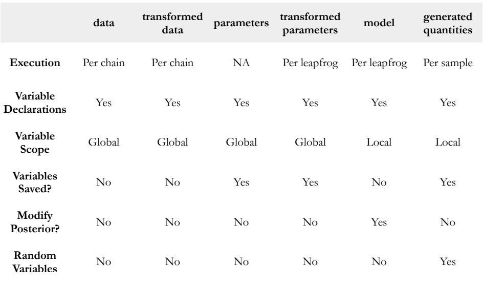

```{r setup, results='hide'}
knitr::opts_chunk$set(echo = TRUE)
library(tidyverse)
library(rstan)
library(rethinking)
```
## Introduction of tidyverse
###Reference: 
Become a master: 
<https://www.datacamp.com/courses/introduction-to-the-tidyverse?tap_a=5644-dce66f&tap_s=194899%E2%80%931fb421&source=post_page>

Learning by doing:

1. 輕鬆學習r語言: <https://medium.com/datainpoint/r-essentials/home>

2. tidyverse style guide: <https://style.tidyverse.org/index.html>

3. 謝吉隆-R4DS(CH 4): <https://docs.google.com/document/d/1e7jd9TAi1hppu0di5yZsDXbwoX2oAJ2O4l6UESVJePU/edit#heading=h.h4fy3dyecxiw>

4. 謝吉龍-新聞資料處理與視覺呈現: <https://github.com/P4CSS/R1072>

This is a quick tutorial for the common tidyverse style code we will use in the QBS course. I won't talk about the detail of each function but focus on the basic use and the logic of the code. Also, I provide some references for you to go further.


### pipeline operator
ref: <https://style.tidyverse.org/pipes.html>

The pipeline operator will put the object on its left to the function on its right.
```{r}
iris

mean(iris$Sepal.Length)
iris$Sepal.Length %>% mean()

lm(Sepal.Length ~ Sepal.Width, data = iris)
iris %>% lm(Sepal.Length ~ Sepal.Width, data = .)

```

When doing data analysis, it's very common that we have to apply several operations on the same data.

For example, we may want to calculate the mean and sd of different species in the iris data set. In this case, we need to do the following things:

1. `select` the required columns

2. `group` the data by species

3. use `summarise` function to get the result

With the pipeline operator, we can chain the three steps into one line, which makes the code better for understanding.
```{r}
iris %>% 
  select(Sepal.Length, Species) %>% 
  group_by(Species) %>% 
  summarise(mean(Sepal.Length),
            var(Sepal.Length))
iris %>% 
  select(Species, Sepal.Length) %>% 
  group_by(Species) %>%
  summarise(mean(Sepal.Length),
            var(Sepal.Length))

```
In comparison, if we use the base r function, the code may be something like this:
```{r}
aggregate(iris$Sepal.Length, by = list(iris$Species), FUN = mean)
aggregate(iris$Sepal.Length, by = list(iris$Species), FUN = var)
```

### Common task done by Tidyverse
ref: <https://medium.com/datainpoint/dplyr-%E5%85%AD%E5%80%8B%E5%9F%BA%E6%9C%AC%E8%B3%87%E6%96%99%E8%99%95%E7%90%86%E6%8A%80%E6%B3%95-d6cf16606fd0>

Here we will use the `iris` data to demo the following tasks using tidyverse

1. column selection

2. row selection (filtering)

3. create data.frame/tibble

4. add a column

```{r}
# column selection
iris %>% select(-Sepal.Width)

# row filtering
iris %>% filter(Sepal.Length > 5.87)

# create data.frame/tibble
data1 = data.frame(
  a = iris$Sepal.Length,
  b = iris$Sepal.Width,
  c = iris$Petal.Length)

data2 = tibble(
  a = iris$Sepal.Length,
  b = iris$Sepal.Width,
  c = iris$Petal.Length)

data3 = as.data.frame(data2)
data4 = as_tibble(data1)

# add a column: Sepal.Length / Sepal.Width
data5 = tibble(
  a = iris$Sepal.Length,
  b = iris$Sepal.Width
)
data5$c = data5$a / data5$b

data6 = tibble(
  a = iris$Sepal.Length,
  b = iris$Sepal.Width) %>% 
  mutate(c = a / b)
```

### Apply  function family
ref:

1. <https://www.guru99.com/r-apply-sapply-tapply.html>

2. <https://www.r-bloggers.com/r-tutorial-on-the-apply-family-of-functions/>

3. <https://www.datacamp.com/community/tutorials/r-tutorial-apply-family>

`apply` function can be viewed as a substitute to the loop, in r, using apply instead on loop is important for better **efficiency**. 

`apply` is usually used on a 2-D dataset. When we want to do some calculation on each row or each column of the data, it's the time to use `apply`.
```{r}
iris %>% 
  select(-Species) %>% 
  apply(., 2, mean)

test = 
  tibble(
    a = iris %>% 
        select(-Species) %>% 
        apply(., 1, function(a) a[1]+a[2]+a[3]+a[4]),
    b = iris %>% 
        select(-Species) %>% 
        apply(., 1, sum)
  )

```


### Plotting by ggplot2
ref: 

1. <https://blog.gtwang.org/r/ggplot2-tutorial-layer-by-layer-plotting/>

2. <https://www.jianshu.com/p/03719d7c207f>

3. <http://lifesci-murmur.blogspot.com/2017/11/r-ggplot-point-plot-boxplot.html>

4. <http://lifesci-murmur.blogspot.com/search/label/ggplot>

ggplot allows you to draw a plot by layers.
plot = data + Aesthetics + geometry

1. create the ggplot object with the data set

2. incrementally add layers
   + graph part: geom_xx
   + text part: label, title...etc
   + graph style: theme

#### Geometry
```{r}
# one dimension: histogram
a = iris %>% ggplot() +
  geom_histogram(aes(Petal.Width), bins = 30) +
  geom_histogram(aes(Petal.Width), bins = 20, colour="blue", alpha=0.5)

# two dimension: lineplot, areaplot
iris %>% ggplot() +
  geom_line(
    aes(x=1:150,
        y=Petal.Width)) +
  geom_line(
    aes(x=1:150,
        y=seq(1,150)/10),
    linetype="dashed"
  ) +
  geom_ribbon(
    aes(x    = 1:150,
        ymin = seq(1,150)/10 -.5,
        ymax = seq(1,150)/10 +.5),
    alpha=0.5)

```

#### legend / color
In a 2-D plot like a line plot or a scatter plot, setting the color is like adding one more dimension to the plot. So we need to specify how we want to color the plot by adding one more variable in the aesthetic statement.

```{r}
# legend
p = iris %>% ggplot() +
  geom_line(
    aes(x=1:150, y=Petal.Width, color='True')) +
  geom_line(
    aes(x=1:150, y=seq(1,150)/10, color='Predict')) + 
  scale_color_manual(values = c("blue", "black"))

p
# label / title
p +  
  labs(y="Length", x="Observation", color="", title="TA is handsome")
```


## Introduction of Stan
### Reference
Stan User Guide: <https://mc-stan.org/docs/2_19/stan-users-guide/index.html>

Tutorial: <https://ourcodingclub.github.io/2018/04/17/stan-intro.html>

Cheat sheet: <http://www.sumsar.net/files/posts/2017-bayesian-tutorial-exercises/stan_cheat_sheet2.12.pdf>

Tutorial: <http://mlss2014.hiit.fi/mlss_files/2-stan.pdf>

So firstly, `Stan` is a probabilistic programming language for Bayesian inference and optimization. 
`Stan` allows us to write down our own statistical model.

1. `Stan` data types and syntax
2. Case study: `lm()` vs `Stan` 

I will introduce the data types and syntax we use in the class, and demonstrating a simple linear regression model with `Stan` and compare it with the `lm` funciton in base r.

In this tutorial, I will focus on the big picture of coding a `Stan` program, in future lectures, you will learn about the details of the model.

### Base r: lm()
I won't talk about the detail on base r since we won't use it anymore in this course.

We simply use the `lm` function to fit a linear regression model.

To make predictions and CI, just use the `prediction` function.

Lastly, we plot true value on a scatter plot, plot predictions on a line plot, and use `geom_ribbon` to plot the CI as we did in tutorial 0.1.5.
```{r}
# Fit lm model
model = iris %>% lm(Sepal.Length ~ Sepal.Width, data = .)

# Prediction and CI
back.test = 
  data.frame(
    Sepal.Width = iris$Sepal.Width,
    Sepal.Length = iris$Sepal.Length) %>% 
  mutate(
    pred.y = predict(model, .),
         
    lower  = predict(model, ., 
                     interval = "confidence",
                     level=0.95)[,2],
         
    upper  = predict(model, .,
                     interval = "confidence",
                     level=0.95)[,3])

# Plotting the prediction value against the true value.
back.test %>%
  ggplot() +
  geom_point(aes(Sepal.Width, Sepal.Length)) + # true value
  geom_line(aes(Sepal.Width, pred.y)) +        # pred value
  geom_ribbon(                                 # CI
    aes(
      x = Sepal.Width,
      ymin = lower,
      ymax = upper),
    alpha=.5)
```

### Stan lm
In `Stan`, the process is very similar.
1. Write down the statistical model
2. Fit the data into the model
3. Prediction and CI

Let's begin by writting writing a linear model in `Stan`.
A Stan program has three required “blocks”:

1. "**data**": data block is where we set the input of model, we have to declare the data types, their dimensions etc.

2. "**parameters**": This is where you indicate the parameters you want to estimate. For a linear regression, we will want to estimate the intercept, the slopes, and the standard deviation of the errors around the regression line.

3. "**model**": The model block is the core of the Stan program, we have to specify the likelihood function of the statistics model we use. 
For a linear regression model, we assumed that y is equal to intecept + coefficient * x + error term, and the error term follows a normal dist.

There are 4 other optional blocks as well:

1. "**generated** **quantities**": A useful block for us to make predictions and calulate the likelihood.

2. "**transformed** **data**": not now

3. "**transformed** **parameters**": not now

4. "**functions**": In Stan we can write our cutomized function as well. However, we have to declare the function in the **funcitons** block.

Professor Sunny will explain why we prefer `Stan` over lm despite all the complexity.

#### Create the model
```{r, results='hide'}
lm.model = "
data {
	int N;  // length of data
	vector[N] x;
	vector[N] y;
}
parameters {
	real alpha;
	real beta;
	real<lower=0> sigma;
}
model {
  // prior
	alpha ~ normal(0,5);
	beta ~ normal(0,1);
  sigma ~ normal(0,1);

  //model
	y ~ normal(alpha + beta * x, sigma);
}
generated quantities {
	real pred_y[N];
  pred_y = normal_rng(alpha + beta * x, sigma);
}
"
lm.data = list(
  N = nrow(iris),
  x = iris$Sepal.Width,
  y = iris$Sepal.Length
)
lm.fit = stan(model_code = lm.model, data = lm.data, chains = 1)
```

#### Get the summary report

ref: <https://www.rdocumentation.org/packages/rstan/versions/2.19.2/topics/stanfit-class>

```{r, results='hide'}
# just get the mean
get_posterior_mean(lm.fit, pars=c("alpha","beta", "sigma"))

# get full summary
summary(lm.fit)

# get prediction and CI
pred = summary(lm.fit, pars="pred_y", probs=c(0.025, 0.975))[[1]] %>% 
  as.data.frame() %>% 
  select(mean, "2.5%", "97.5%") %>% 
  mutate(Sepal.Width = iris$Sepal.Width,
         Sepal.Length = iris$Sepal.Length)
```
#### Plotting prediction and CI
```{r}
pred %>% ggplot() + 
  geom_point(aes(Sepal.Width, Sepal.Length)) +
  geom_line(aes(Sepal.Width, mean))+
  geom_ribbon(
    aes(
      x = Sepal.Width,
      ymin = `2.5%`,
      ymax = `97.5%`),
    alpha=0.5)
```

#### Stan syntax
In the regression example, you will notice something strange:

1. `y` ~ `normal()` vs. `pred_y` = `normal_rng()`

2. vector[N] y vs. real pred_y[N]

3. `mu` in both **model** and **generated quantities**


1. `y` ~ `normal()` vs. `pred` = `normal_rng()`
```{r, results='hide'}

"model {
  mu = alpha + beta * x;
  y ~ normal(mu, sigma);
}"


"generated quantities {
  real pred_y[N];
  mu = alpha + beta * x;
  pred_y = normal_rng(mu, sigma);
}
"
```

2. vector[N] y vs. real pred_y[N]

`vector[N] y` is a vector, which supports linear algebra calculation.

`real pred_y[N]` is an array of reals.

rng_function: <https://mc-stan.org/docs/2_18/functions-reference/vectorization.html#prng-vectorization>

vector vs. array: <https://mc-stan.org/docs/2_19/stan-users-guide/basic-motivation.html>
```{r, results='hide'}
# x: vector
# y: vector

"model {
  mu = alpha + beta * x;
  y ~ normal(mu, sigma);
}"

# normal_rng will return an array of reals, which can't be assigned to a vector
"generated quantities {
  real pred_y[N];
  mu = alpha + beta * x;
  pred_y = normal_rng(mu, sigma);

  // alternative way
  vector[N] pred_y;
  for (1:N){
    mu = alpha + beta * x[i];
    pred_y[i] = normal_rng(mu, sigma);
  }
}
"
```

3. `mu` in both `model` and `generated quantities`

In each block, the variables have different scope. Variables declared in model block are local variables and can't be used directly in other blocks.

Table found in <http://mlss2014.hiit.fi/mlss_files/2-stan.pdf>


